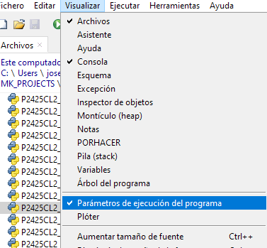
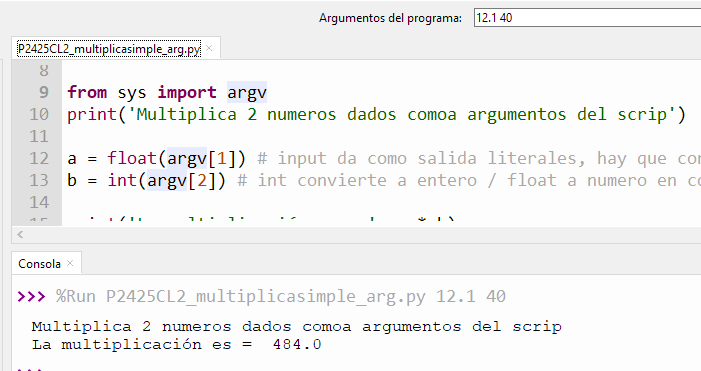
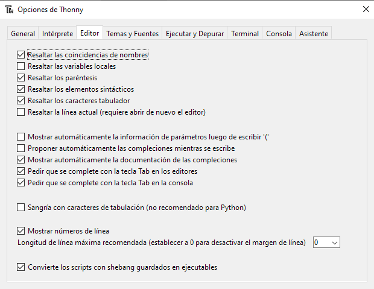

# CL2b - Escribir los primeros programas en Python con Thonny - PyR 2024_25 CMM BML

## Clase 2b - Indice - 180 minutos

- ¿ Como usar el libro ***Invent with Python ...***?

- Flujos básicos de un programa con ejemplos
  
  - Secuencia
  
  - Indentación y bloques
  
  - Bucle **while**
  
  - Seleccion con **if**
  
  - Errores / Eventos : **Try-Except** + Contextos **with**

- Facilidades de Thonny para escribir programas

- Uso de Debug de Thonny, con un ejemplo de programa mal escrito

- Conceptos cubiertos en este capitulo

- Preguntas sobre la Clase 1 - 10 minutos

## Tutoriales y Programas que vamos a seguir

### Tutoriales resumen

[Introducing Thonny - YouTube](https://youtu.be/nwIgxrXP-X4?si=eb19qXyd4cJWSYng)

### Tabla resumen de programas

| Programa                                                                 | Lenguaje | HW si Robotica y Notas                                                 | Objetivo de Aprendizaje                                        |
| ------------------------------------------------------------------------ | -------- | ---------------------------------------------------------------------- | -------------------------------------------------------------- |
| [P2425CL2_holaplus.py](./P2425CL2_holaplus.py)                           | Python   |                                                                        | **<u>Flujo en secuencia</u>**                                  |
| [P2425CL2_multiplicasimple.py](./P2425CL2_multiplicasimple.py)           | Python   |                                                                        | <u>**Flujo en secuencia**</u> **Tipos numéricos**, 2 variables |
| [P2425CL2b_multiplicasimple_arg.py](./P2425CL2b_multiplicasimple_arg.py) | Python   |                                                                        | <u>**Flujo en secuencia**</u> Python como script               |
| [P2425CL2_cuentaAtras.py](./P2425CL2_cuentaAtras.py)                     | Python   | Se podía haber hecho con for                                           | **bucles while** Flujo en bucles                               |
| [P2425CL2_parimpar.py](P2425CL2_parimpar.py)                             | Python   |                                                                        | **Selección** con **if**                                       |
| [P2425CL2b_divideMAL.py](P2425CL2b_divideMAL.py)                         | Python   |                                                                        | Error división por cero no manejado                            |
| [P2425CL2b_divideTry.py](P2425CL2b_divideTry.py)                         | Python   |                                                                        | **Try-Except **: erro de división por cero manejado            |
| [P2425CL2b_relojTry.py](P2425CL2b_relojTry.py)                           | Python   |                                                                        | **Try-Except-Finally** ejemplo parando programa por teclado    |
| [P2425CL2_debugPcafeBIEN.py](P2425CL2_debugPcafeBIEN.py)                 | Python   | Varios programas mal escritos para ir corrigiéndolos hasta el correcto | uso básico de Debug, basico por no usar breakpoints            |

### Recomendaciones de estudio despues de la clase

[Estructuras de control - Libro de python](https://ellibrodepython.com/estructuras-control-python)

**+**

Leer capitulo 2 de libro "Invent with python"" [Chapter 2 - Writing Programs](https://inventwithpython.com/invent4thed/chapter2.html), que muestra un IDE muy sencillo que viene con el propio Python y que se llama IDLE

---

## ¿Cómo usar el libro ***Invent with Python ...***?

Se muestra en la clase como usar la web del libro en ingles y el libro en castellano

## Flujos básicos de un programa (estructuras de control)

El aprendizaje básico de la programación en cualquier lenguaje implica 

- poder escribir programas con **estructuras de flujo complejas**

- manejar **tipos de datos simples o compuestos**  adaptados a las necesidades.

Nota : básico = sin usar funciones (programación funcional) ni programación orientada a objetos.

En vez de hacer un repaso de tipos de datos y tipos de flujo, en este curso preferimos aprender realizando proyectos o viendo ejemplos adaptados al momento de aprendizaje. Con esta lógica, es mas útil **empezar con ejemplos de flujos usando tipos simples de momento**

Los flujos básicos de un programas (cualquier lenguaje):

1. Secuencia: es el flujo normal, no hay palabra clave

2. Selección : el flujo se bifurca según una condición

3. Bucle: repetimos instrucciones con algun cambio en un valor , o similar; se requiere una condición de salida del bucle

4. Eventos / Errores

### <u>Flujo en secuencia</u> + entrada , salida , variables, tipos int y float

#### Holaplus

[P2425CL2_holaplus.py](./P2425CL2_holaplus.py)

Este programa usa:

1. Comentarios que aclararan información sobre el programa , comienzan con un `#` [mas info](https://ellibrodepython.com/sintaxis-python#comentarios)

2. Salida por pantalla  `print ` , esta instrucción es muy versátil, [mas info sobre print]([Salida por pantalla: print(). Python. Bartolomé Sintes Marco. www.mclibre.org](https://www.mclibre.org/consultar/python/lecciones/python-salida-pantalla.html))

3. Entrada `input ` [mas info sobre input]([Entrada por teclado: input(). Python. Bartolomé Sintes Marco. www.mclibre.org](https://www.mclibre.org/consultar/python/lecciones/python-entrada-teclado.html))

4. se ve por primera vez como se crea una variable [mas info sobre variables en pynton]()

#### Multiplicasimple : tipos simples int y float

[P2425CL2_multiplicasimple.py](./P2425CL2_multiplicasimple.py)

Seguimos con el flujo en secuencia y exploramos los tipos simples int y float

Es recomendable usar el método type(variable) para ver los tipos en este programa

```
>>> %Run P2425CL2_multiplicasimple.py
¡Hola clase! Dime 2 números y los multiplicaré
Dime el 1er número en coma flotante: 12.1
Dime el 1er número entero: 45
La multiplicación es =  544.5
>>> type(a)
<class 'float'>
>>> type(b)
<class 'int'>
>>> 
```

#### Multiplicasimple_arg : uso de python como <u>script</u>

Un programa en python se puede ejecutar directamente en una ventana de comandos del ordenador. Si estamos en windows abrimos una ventana de comandos con cmd o powershell y podemos ejecutar el programa multiplica simple por ejemplo:

```
C:\...rog>P2425CL2_multiplicasimple.py
¡Hola clase! Dime 2 números y los multiplicaré
Dime el 1er número en coma flotante: 10.2
Dime el 1er número entero: 5
La multiplicación es =  51.0

C:\Users\josec\OneDrive\Documentos\03_MAKER\MK_PROJECTS\CMM_MK_2410O_J25\2425_CL2_Escrib1rosProg>
```

 A este uso se le llama uso como script, y es conveniente saber que se le pueden **pasar parámetros al programa cuando se invoca como script**. Para ello, la forma más sencilla es usar la libreria `sys` y concretamente la lista `argv[]` : 

- argv[0] = nombre del programa

- argv[1] = primer parámetro pasado

- argv[2] = segundo parámetro

- ....

Veamos como se hace con el programa de multiplicación ligeramente modificado para aceptar parámetros

[P2425CL2_multiplicasimple_arg.py](./P2425CL2_multiplicasimple_arg.py)

```
C:\....\2425_CL2_Escrib1rosProg>P2425CL2_multiplicasimple_arg.py 12.5 10
Multiplica 2 numeros dados comoa argumentos del scrip
La multiplicación es =  125.0
```

También se pueden probar scripts con parámetros en Thony. Primero habilitamos la line de parámetros



y ahora veamos como ejecutar



AVANZADO : Hay una forma mas elaborada de usar argumentos en scripts con [argparse]([argparse — Analizador sintáctico (Parser) para las opciones, argumentos y sub-comandos de la línea de comandos &#8212; documentación de Python - 3.10.16](https://docs.python.org/es/3.10/library/argparse.html)) — Analizador sintáctico (Parser) para las opciones, argumentos y sub-comandos de la línea de comandos¶

### Indentación en Python

Antes de empezar con estructuras de programación, es necesario saber que **en Python los bloques de código se representan con Indentación**, y aunque hay un poco de debate con respecto a usar tabulador o espacios, la norma general es usar **4 espacios** ( o 2 espacios que promueven los programadores de Google). Es decir la Indentación NO es para hacer mas legible el codigo sino que forma parte de la identificación de bloques.

Cuando los flujos no son secuenciales, los bloque se identifican por el interprete Python porque estan endentados en la misma cantidad. Cuando la Indentación cambia, cerramos y cambiamos de bloque.

### <u>Flujo selección</u>

La manera de seleccionar un flujo u otro es con una condición lógica que sea verdadera o falsa. Las expresiones con condiciones lógicas puede ser muy complejas y no vamos a profundizar hoy en ellas.

En Python la estructura de selección  se 'arma' con if .. else ( lo veremos a continuación) . 

AVANZADO : Python no ha contado con estructuras mas complejas como  ‘switch-case’ o ‘cond’ de forma intencionada, hasta la versión 3.10 con la incorporación de match .. case (no lo veremos hoy) . Para selecciones de +2 opciones se cuenta con if ... elif... elif... else

#### Par o Impar : estructura if .. else

[P2425CL2_parimpar.py](P2425CL2_parimpar.py)

La estructura es sencilla, como se ve en el programa y el 'else' se puede omitir si solo queremos que se ejecuten o no unas instrucciones.

### <u>Flujo Bucle </u> - bucles while y for

En todos los lenguajes se implementan bucles de 2 formas:

- <u>con final predefinido al entrar</u> ==> **for**

- <u>con final dependiente de una condición</u> ==> **while**

En realidad siempre se puede escribir un bucle tanto con **for** como con **while**, pero una de las dos maneras estará forzada. 

En Python los <u>bucles **for** se han 'ampliado'</u> para recorrer objetos complejos, sin el uso de índices ni otras complejidades, lo que le da a los programas mas sencillez

RECOMENDACION : usa bucles **while** al principio hasta entender un poco los objetos complejos que se pueden recorrer con **for**

#### CuentaAtras.py

[P2425CL2_cuentaAtras.py](./P2425CL2_cuentaAtras.py)

Se trata de hacer un simple programa de cuenta atras. Por ser de final definido seria mas natural hacerlo con for, pero como se ha dicho for tiene en Python ciertas reglas que lo hacen algo oscuro al principio, por lo que se ha implementado con while

### <u>Flujo Evento/Excepcion </u> - Try..except .. finally

Si la ejecución de un bloque de codigo puede dar lugar a errores, el interprete parará la ejecución y mostrará el error, pero salvo en programas en testeo, NO queremos eso: **queremos que los errores (previsibles) se traten y se ejecute un bloque de codigo de 'limpieza' y/o mensaje comprensible**

El ejemplo clásico es la división por cero:

[P2425CL2_divideMAL.py](P2425CL2_divideMAL.py)

Y ahora con un tratamiento del error informando de lo que ha ocurrido

[P2425CL2_divideTry.py](P2425CL2_divideTry.py)

Otro uso posible es manejo de eventos externos como **parar un programa por teclado con Control+C, de forma que se ejecute un codigo de limpieza o un mensaje**

[P2425CL2b_relojTry.py](P2425CL2b_relojTry.py)

### <u>Flujo Contexto </u> - with.... SIN EJEMPLO

Un caso especial de **tratamiento de errores previsibles para hacerlo mas cómodo al programado**r,  es el uso de la sentencia **with**: se usa para asegurar que en la ejecución de un bloque, se ejecutan SIEMPRE al principio y al fin ciertas operaciones predefinidas según el tipo de datos. Esto descarga al programador de la gestión de errores con try.. except ... finally

Lo veremos en cuanto usemos ficheros tanto en python como en micropython

## Facilidades de Thonny para escribir programas



Yo considero muy útiles:

- Completar palabras reservadas con tabulador + mostrar documentación

- Resaltar coincidencias de nombres

pero es algo personal que cada programador debe decidir. 

## Depurar programas (Debugger) en Thonny

Antes de seguir, conviene saber usar el depurador que incluye Thonny. Un buen video introductorio es 

[Ejemplo Python: Encuentra los errores de tus programas usando el debugger de Thonny - YouTube](https://youtu.be/NYYT0J8nf3o?si=UcN4g8975rK0qkV8)

Lo vamos a hacer en vivo siguiendo un ejemplo casi igual la del video, pero antes veamos los 3 tipos de error ( cap 6 invent with python..)

#### **Types of Bugs**

Hay 3 tipos de errores en programación:

- **Sintáticos** Es el más sencillo de resolver, por ser un simple error tipográfico, ejemplo en vez de 'print' se escribe  'prin' When the Python interpreter sees a syntax error, it’s because your code isn’t written in proper Python language. A Python program with even a single syntax error won’t run.

- **Runtime** Ocurren mientras el programa se ejecuta y detiene el programa mostrando la línea donde se paró y una traza del error (que a veces puede ser muy difícil de interpretar) . Normalmente el error estará en la la línea de detención, aunque si hay llamadas a funciones o usamos clases con métodos, el origen del error puede estar en estas funciones o métodos.

- **Semántico** Son los mas difíciles de arreglar: no hacen que el programa detenga su ejecución, sino que hacen algo distinto a lo previsto. Por ejemplo si queremos una variable que sume el total de otras 3 y escribimos `total = a * b * c`, el valor no será el total, y esto impactara en el programa en un punto posterior, asi que rastrear el origen puede ser complicado

| Programa                                                 | 1er Error                           | Tipo de Error |
| -------------------------------------------------------- | ----------------------------------- | ------------- |
| [P2425CL2_debugPcafeMAL1.py](P2425CL2_debugPcafeMAL1.py) | Sintaxis indentación print          | Sintáctico    |
| [P2425CL2_debugPcafeMAL2.py](P2425CL2_debugPcafeMAL2.py) | Sintaxis indentación else           | Sintáctico    |
| [P2425CL2_debugPcafeMAL3.py](P2425CL2_debugPcafeMAL3.py) | Division por cero                   | Run time      |
| [P2425CL2_debugPcafeMAL4.py](P2425CL2_debugPcafeMAL4.py) | Concicion 2do if : and en vez de or | Semántico     |
| [P2425CL2_debugPcafeBIEN.py](P2425CL2_debugPcafeBIEN.py) | SIN ERRORES                         |               |

Nota : Para aprender a usar debug, se puede consultar también [el capitulo 6 del llibro invent con ....](https://inventwithpython.com/invent4thed/chapter6.html)  pero emplea un IDE diferente a Thonny y quizá os lie

## Conceptos cubiertos en este capitulo - 5'

En esta clase hemso cubierto los siguientes conceptos: 

- Cadenas de caracteres + unir cadenas

- Tipos de datos:
  
  * Enteros, decimales (float)
  
  * Cadenas
* Usar editor de Thonny

* Salvar los programas en Thonny

* Comments

* Funcion print()

* Función input()

* Flujo secuencia

* Bloques de codigo e Indentación

* Flujo Bucle while

* Flujo Selección con if

* Flujo errores : Try-Except básico + AVANZADO : with

* Facilidades de Thonny al escribir programas

* NO es lo mismo mayúsculas que minúsculas

* **Debugger con Thonny ( básico)**

## Preguntas sobre la Clase 2 - 10 minutos

Sección para que los alumnos pregunten sus dudas durante la clase

--
