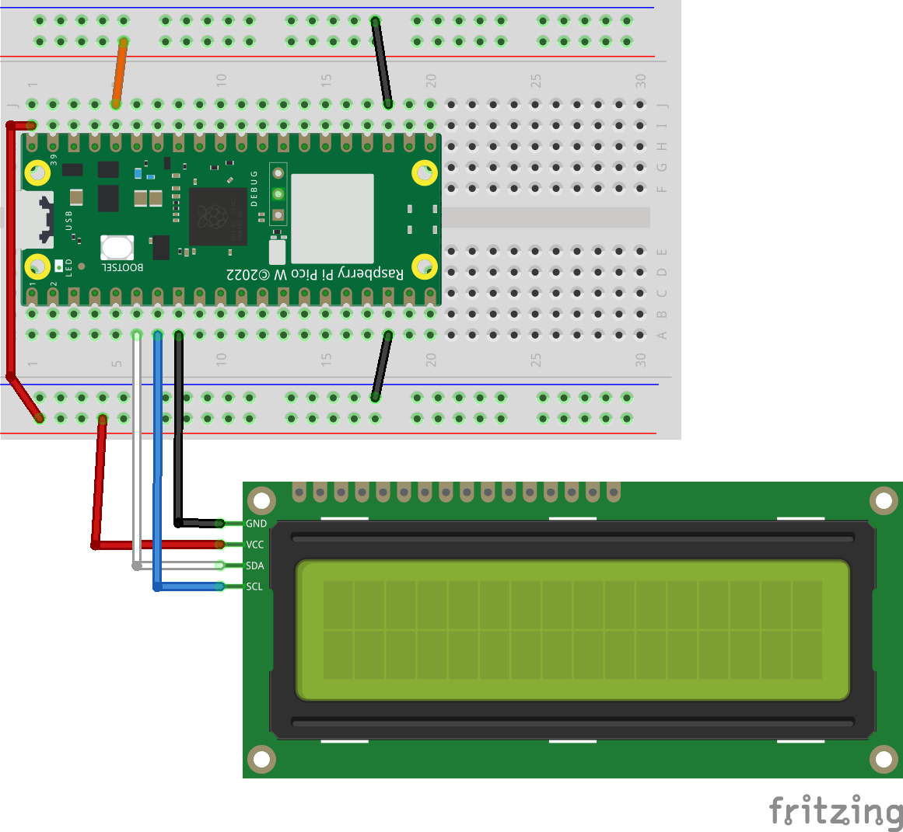
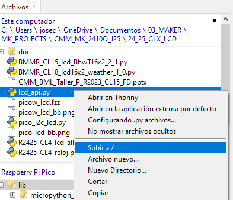
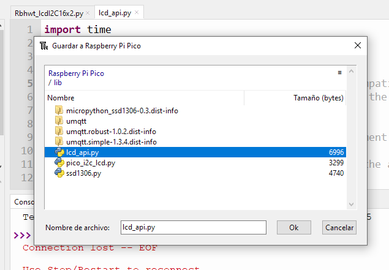

# CL5 - LCD i2c 16x2 uso - PyR 2024_25 CMM BML

## Clase 5 - Indice - 90 minutos

- Previo: ¿Por qué esta vez sin teoría?

- Montaje HW

- 2 Demos (empezamos por el final)
  
  - Caracteres en secuencia
  
  - Reloj hh:mm:ss 

- Explicación mínima: protocolo i2c (mínima)
  
  - Basic HW test 'I2C scan' con 2 dispositivos LDC e MPR121

- Aprender a usar la Libreria seleccionada
  
  - Selección : No es un estándar, pero casi / no usamos la de Sunfounder
  
  - Libreria detalle de funciones
  
  - Revisitar Demos
  
  - Extra: generador de caracteres 

- Conceptos cubiertos en este capitulo

- Preguntas sobre la Clase 1 - 10 minutos

## Tutoriales y Programas que vamos a seguir

### Tutoriales resumen

En Ingles 

- [Character LCD - MicroPython for Kids](https://www.coderdojotc.org/micropython/displays/non-graph/10-character-lcd-display/) 

- [Raspberry Pi Pico Tutorial: 16x2 LCD I2C Micropython - YouTube](https://youtu.be/bXLgxEcT1QU?si=4KQbfWEfnXcb7wdR)

No conecta le LCD en las mismas posiciones pero por lo demas usa las misma librerias

En castellano

[▷ LCD I2C Raspberry Pi Pico - ESP32/8266 [MicroPython]](https://controlautomaticoeducacion.com/sistemas-embebidos/micropython/lcd-i2c-raspberry-pi-pico/)[▷ LCD I2C Raspberry Pi Pico - ESP32/8266 [MicroPython]](https://controlautomaticoeducacion.com/sistemas-embebidos/micropython/lcd-i2c-raspberry-pi-pico/)

### Tabla resumen de programas

| Programa                                                             | Lenguaje | HW                    | Objetivo                                                                    |
| -------------------------------------------------------------------- | -------- | --------------------- | --------------------------------------------------------------------------- |
| [Rbhwt_lcdI2C16x2.py](Rbhwt_lcdI2C16x2.py)                           | uPy      | LCD 16x2 i2c gpio 4&5 | Es un test HW básico del display                                            |
| [Rbhwt_I2Cscan.py](Rbhwt_I2Cscan.py)                                 | uPy      | idem                  | Es un test HW del bus I2c lo usaremos con muchos periféricos                |
| [R2425_CL4_lcd_allchar.py](R2425_CL4_lcd_allchar.py)                 | uPy      | idem                  | Es un test HW del display que muestra todos los caracteres en bloques de 32 |
| [R2425_CL4_reloj.py](R2425_CL4_reloj.py)                             | uPy      | idem                  | Demo de uso - reloj de segundos                                             |
| [R2324_CL18LCD16x2_weather_1_0.py](R2324_CL18LCD16x2_weather_1_0.py) | uPy      | idem                  | Demo de uso - Muestra tiempo usando la API de openweather                   |

### Recomendaciones de estudio despues de la clase

Ver tutoriales i2c

---

## Previo: ¿Por qué esta vez sin teoría?

He pensado que 

1. dado se pueden hacer proyectos mucho mas vistosos/ profesionales con LCD con poco esfuerzo, y 

2. dado que es el único display que hay en el kit

Era un apena no poder usarlo desde los primeros mini-proyectos. Por eso simplemente, se posponen un poco algunas explicaciones más de detalle, en aras de la utilidad.

## Montaje HW

Cableado y conexiones : **Importante alimentar a 5voltios**



### ¿Por qué funciona sin conversor de niveles 3.3v <-> 5v ?

Veréis montajes que indican que hay que usar un conversor de niveles logicos entre el display que usa niveles lógicos de 5 voltios y la Pico que usa 3.3 voltios. Siendo purista habria que usar un conversor para las comunicaciones de 2 hilos i2c : SDA y SCL, pero no es necesario.

Como la comunicación es unidireccional ( el display no envía datos ) del micro PIco -> Display solo hay que asegurar que los voltios de in nivel lógico '1' a 3.3 voltios , entran dentro del rango de lo que se interpreta como '1' a 5 volt. En realidad estamos estamos en el limite:

En Lógica a 5 volt ( CMOS)  se interpreta un '1' desde 0,7 x volt de alimentación = 3.5volt, pero normalmente el voltaje será de 4,7 es decir un '1' debería tener un nivel minimo de 0,7 x 4,7volt = 3,3. Además las líneas SDA y SCL tienen en el display ( mas bien en el modulo PCF8574) un pull-up de 4,7k ohm, con lo que se garantiza que el '1' este a 3.3 volt

## 2 Demos (empezamos por el final)

### Demo 1 Caracteres en secuencia

[R2425_CL4_lcd_allchar.py](R2425_CL4_lcd_allchar.py)

Lo vemos. Básicamente el programa va generando caracteres de 32 a 256 para ver como se representan en el display. 

1. Los trocea en bloques de 32, 

2. limpia el display , que tiene el efecto de posicionar el cursor en 0,0 y 

3. escribe la cadena de 32 caracteres.

### Demo 2 Reloj

[R2425_CL4_reloj.py](R2425_CL4_reloj.py)

En un bucle while True 

1. recoge la hora actual de la libreria utime.localtime(), 

2. Formatea la cadena con fecha y hora

3. Lo escribe en columna 0, linea 1 ( 2da) 

4. espera 1 segundo y vuelta a empezar

Interesante ver como sale por interrupcion de teclado con Try-Except , borrando el display

### Demo 3 - Tiempo meteorológico usando la API de openweather

Lo interesante en este caso es usar las posibilidades wifi del Pico W junto al display

La información es muy básica y necesita mejoras de representación

[R2324_CL18LCD16x2_weather_1_0.py](R2324_CL18LCD16x2_weather_1_0.py)

## Explicación mínima: protocolo i2c

No se va a explicar el protocolo de comunicación i2c, por lo dicho en el preámbulo. Si se quiere una explicación mirar, por ejemplo ( hay muchos tutos) 

[Entender el protocolo i2c](https://controlautomaticoeducacion.com/sistemas-embebidos/micropython/lcd-i2c-raspberry-pi-pico/#Entendiendo_el_Protocolo_I2C_Comunicacion_Simple_y_Eficiente)

o

Lo minimo que necesitamos saber es 

- **Conexión**: La pico tiene 2 buses i2c : '0' y '1'. Es preferible usar los pines I2c por defecto en la Pico son

```
# I2C0  I2C(0, scl=Pin(5), sda=Pin(4), freq=400_000)
# I2C1  I2C(1, scl=Pin(7), sda=Pin(6), freq=400_000)
```

- **Dirección** : cada dispositivo I2c tiene una dirección que va del 0 - 127 ( 7 bits) . Normalmente estan asignadas por el tipo: los displays LCD usan 0x3F y 0x3E. La forma mas sencilla de saber la dirección es hacer un i2c scan una vez conectado todo

[Rbhwt_I2Cscan.py](Rbhwt_I2Cscan.py)

si no aparece ningún dispositivo HAY QUE REVISARLO TODO

> I2C(0, freq=399361, scl=5, sda=4, timeout=50000)
> 
> Scanning I2C bus.
> 
> 1 devices found.
> 
> Decimal address: 63 , Hex address:  0x3f

Es interesante hacer un  'I2C scan' con 2 dispositivos i2c conectados, por ejemplo un LCD y un MPR121 (teclado tactil). Veamos la salida del scan con 2 dispositivos i2c

> I2C(0, freq=399361, scl=5, sda=4, timeout=50000)
> 
> Scanning I2C bus.
> 
> 2 devices found.
> 
> Decimal address: 63 , Hex address:  0x3f
> 
> Decimal address: 90 , Hex address:  0x5a

- **Frecuencia del bus i2c**: I2C Pines en el uC tienen 3 modos de velocidad: 
  
  - Standard (0 to 100 Kb/s), 
  
  - Fast(<= 400 Kb/s) & 
  
  - Fast Plus mode (<= 1000 Kb/s). 
    
    **Usaremos la velocidad de 400Khz y si da error 5 bajamos la velocidad**
    
    **Si vamos a tener 2 dispositivos i2c en el mimso bus "0", por ejemplo, hay que configurarlo a la velocidad del dispositivo que requiera menor velocidad.** Si queremso no penalizar al dispositivo rapido, habr aque usar el otro bus i2c (el "1" por ejemplo)

## Aprender a usar la Libreria seleccionada de T-622

### Selección: ¿por que esta libreria?

No es un estándar, pero casi. No usamos la de Sunfounder porque 

1. Tiene algunas limitaciones (funciones que no implementa) 

2. La mayoría de los tutoriales usan la libreria de T-622 Tyler Peppy

### Instalación de la libreria

Desgraciadamente esta libreria no esta en micropython-lib ni en PyP , que es donde busca Thonny, asi que Thonny no nos va a ayudar a hacer la instalación y **hay que hacer una instalación manual.**

Necesitamos "subir" 2 ficheros 

[lcd_api.py](lcd_api.py)

y

[pico_i2c_lcd.py](pico_i2c_lcd.py)

a la memoria flash de la Pico W.

Para hacerlo se puede hacer de forma sencilla con "Subir a /"



Pero es mejor que las librerías estén en el directorio de la Pico llamado '/lib'.. Para eso hay que 

1. Abrir el fichero en Thonny 

2. Guardar una copia en Raspberry Pico 

3. selecciona directorio /lib

4. IMPORTANTE : GUARDAR DANDOLE EL MISMO NOMBRE



### Libreria detalle de funciones

#### Creación del objeto LCD para el caso del display de 16 columnas x 2 líneas

```
from machine import Pin, I2C
from lcd_api import LcdApi
from pico_i2c_lcd import I2cLcd

LCD_ADDR = 0x3F
LCD_NUM_ROWS = 2
LCD_NUM_COLS = 16
FREQ = 400_000   # Si da error "Errno 5" reduce el valor de la frecuencia

i2c = I2C(0, sda = Pin(4), scl = Pin(5), freq = FREQ)

lcd = I2cLcd(i2c, LCD_ADDR, LCD_NUM_ROWS, LCD_NUM_COLS)
```

`LCD_ADDR = 0x3F` es la dirección i2c del display ( no queremos entrar en profundidades)

#### **Comandos**

- lcd.putstr("¡El texto va aquí!") - Envía una cadena de caracteres a la pantalla IMPORTANTE: Use esto para imprimir una variable: lcd.putstr(str(Variable)) [Convierte la variable en una cadena]
- lcd.show_cursor() / lcd.hide_cursor() - Mostrar / Ocultar el cursor de la pantalla lcd (barra blanca)
- lcd.blink_cursor_on() / lcd.blink_cursor_off() - Activar / desactivar el cursor parpadeante al imprimir
- lcd.backlight_on() / lcd.backlight_off() - Enciende / Apaga la luz de fondo de la pantalla LCD (controlada por un pequeño transistor en la mochila)
- lcd.display_on() / lcd.display_off() - Enciende / Apaga la pantalla (no la luz de fondo sino todo el chip)
- lcd.clear() - Borra todos los caracteres o cualquier cosa escrita en la pantalla
- lcd.move_to(Col, Row): se mueve a la posición según los valores de fila y columna (Y, X)
- lcd.custom_char(Num, bytearray([HEX chars]))) - Num puede ser cualquier número entero entre 0 y 8 (se escribe en las ubicaciones de CGRAM) y se utiliza únicamente para numerar. 

Errores:

ERROR: 5 (Este es un error bastante común, 5 significa error de E/S. Verifique sus conexiones. Esto significa que no se pueden enviar ni recibir códigos.

### Revisitar Demos

Ahora conociendo mejor la libreria, se pueden re examinar los 2 primeras demos y entender como usar el display en proyectos futuros.

### Extra: generador de caracteres

Los caracteres HEX se crean simplemente mediante este enlace: [LCD Custom Character Generator](https://maxpromer.github.io/LCD-Character-Creator/)

Proporcionará una cadena de caracteres hexadecimales que pueden reemplazar los "caracteres HEX" en el comando de ejemplo.

## Conceptos cubiertos en este capitulo - 5'

En esta clase hemos cubierto los siguientes conceptos de Robotica / micropython: 
- i2c sin entrar en tecnicismos
- Display LCD con libreria T-622

## Sección para que los alumnos pregunten sus dudas durante la clase

---

TO DO : 

1. Mejorar demo openweather para mostrar mas info en display LCD

2. Mejorar demo de tiempo meteo para usar API AEME
