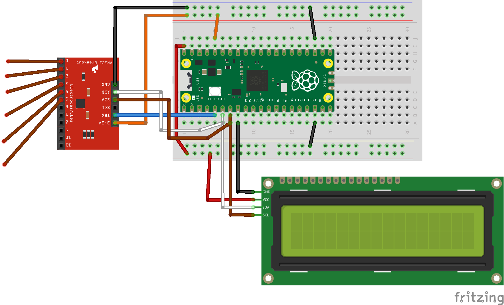
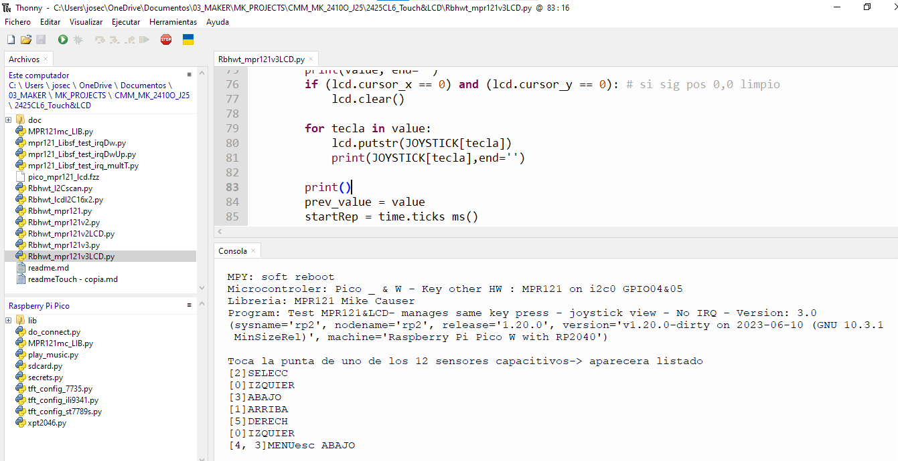

# CL6 HW de entrada para displays> Touch MPR121-  PyR 2024_25 CMM BML

## Objetivo de la serie de clases

Vamos a ir elaborando clases con Hw de entrada por humanos, que sea mas adecuado para combinar con Displays, como por ejemplo:

- Pulsadores momentáneos e interruptores deslizantes  ( modelo universal) 

- **Sensores Táctiles tipo MPR121**

- Codificadores rotativos

- Mandos a distancia por IR ( el que viene en el kit de sunfounder y la mayoria de los kits)

De momento **combinaremos con display ya dado : LCD 16x2**

## Clase 6: Touch MPR121 - Indice - 90 minutos

- Intro: Seguiremos el tuto de Sunfounder, pero ampliamos y sumamos LCD

- Montaje HW

- Libreria MPR121
  
  - Instalación : tomamos la modificada de sunfounder

- 3 Demos sin LCD  y sin interrupciones
  
  - Scan i2c
  
  - v1
  
  - v2
  
  - v3

- 2 Demos con LCD sin interrupciones 
  
  - Basic HW test 'I2C scan' con 2 dispositivos LDC e MPR121
  - Muestra en LCD caracteres pulsado (sin interrupciones basada en v2)

- Aprender a usar la Libreria seleccionada
  
  - Selección : No es un estándar, pero casi 
  
  - Libreria detalle de funciones
  
  - Revisitar Demos

- Conceptos cubiertos en este capitulo

- Preguntas sobre la Clase 1 - 10 minutos

## Tutoriales y Programas que vamos a seguir

### Tutoriales resumen

**En Ingles**

[4.3 Electrode Keyboard &mdash; SunFounder Kepler Kit for Raspberry Pi Pico W 1.0 documentation](https://docs.sunfounder.com/projects/kepler-kit/en/latest/pyproject/py_mpr121.html)

**Libreria**

[GitHub - mcauser/micropython-mpr121: MicroPython driver for MPR121 capacitive touch keypads and breakout boards](https://github.com/mcauser/micropython-mpr121/tree/master)

### Tabla resumen de programas

| Programa                                     | Lenguaje | HW                             | Objetivo                                                                                                                                                     |
| -------------------------------------------- | -------- | ------------------------------ | ------------------------------------------------------------------------------------------------------------------------------------------------------------ |
| [Rbhwt_lcdI2C16x2.py](Rbhwt_lcdI2C16x2.py)   | uPy      | LCD 16x2 i2c gpio 4&5          | Es un test HW básico del display                                                                                                                             |
| [Rbhwt_I2Cscan.py](Rbhwt_I2Cscan.py)         | uPy      | idem                           | Es un test HW del bus I2c lo usaremos con muchos periféricos                                                                                                 |
| [Rbhwt_mpr121.py](Rbhwt_mpr121.py)           | uPy      | MPR121 y LCD 16x2 i2c gpio 4&5 | Es un test HW básico del MPR121                                                                                                                              |
| [Rbhwt_mpr121v2.py](Rbhwt_mpr121v2.py)       | uPy      | idem                           | Es un test HW del MPR121 que muestra las teclas pulsadas en  la consola, pero sin repetir tecla salvo un retardo. Varias teclas simultaneas son posibles     |
| [Rbhwt_mpr121v3.py](Rbhwt_mpr121v3.py)       | uPy      | idem                           | Es un test HW +**Joystick** casero del MPR121, pero sin repetir **valores del Joystick** si se deja pulsado. Usa un diccionario                              |
| [Rbhwt_mpr121v2LCD.py](Rbhwt_mpr121v2LCD.py) | uPy      | idem                           | Es un test HW del MPR121 +LCD que muestra las teclas pulsadas en  en el LCD, pero sin repetir tecla salvo un retardo. Varias teclas simultaneas son posibles |
| [Rbhwt_mpr121v3LCD.py](Rbhwt_mpr121v3LCD.py) | uPy      | idem                           | Es un test HW + **Joystick** del MPR121 +LCD que muestra los **valores de Joystick** en el LCD, pero sin repetir tecla salvo un retardo                      |

### Recomendaciones de estudio despues de la clase

Ver tutorial Sunfounder y ejemplos de libreria de Mike Causer

--- 

## Montaje HW

Cableado y conexiones : 

| MPR121 | Pico o PIcoW                                        |
| ------ | --------------------------------------------------- |
| VCC    | 3V3                                                 |
| IRQ    | GPIO03 ( opcional si no se usan las interrupciones) |
| SCL    | GPIO05 (SCL 0)                                      |
| SDA    | GPIO 04 (SDA 0)                                     |
| GND    | GND                                                 |



## 3 Demos con MPR121, <u>sin LCD</u> y sin interrupciones

### Demo 0 : scan del bus i2c

[Rbhwt_I2Cscan.py](Rbhwt_I2Cscan.py)

Es necesario asegurarse de que l MPR121 es visto por el bus i2c. Chequear que la direccion es la esperada 0x5A. 

### Demo 1 :  Basic HW test de MPR121

[Rbhwt_mpr121.py](Rbhwt_mpr121.py)

Ver si detecta pulsación en cualquiera de los 12 pines disponibles. No se chequea que las pulsaciones se repitan, ni intervalo con la misma tecla pulsada.

Cableado HW ver figura

### Demo v2 - Test de MPR121 no repitiendo tecla ya pulsada

[Rbhwt_mpr121v2.py](Rbhwt_mpr121v2.py)

Guarda el valor de los 12 sensores anterior y lo compara con el nuevo valor leído, para no repetir tecla salvo que sea intencionado. Hay que ajustar tiempo en que la repetición es OK

### Demo v3 - Test de MPR121 no repitiendo tecla ya pulsada y traduciendo a joystick

[Rbhwt_mpr121v3.py](Rbhwt_mpr121v3.py)

- Guarda el valor de los 12 sensores anterior 

- lo compara con el nuevo valor leído, para no repetir tecla salvo que sea intencionado. Hay que ajustar tiempo en que la repetición es OK

- Traduce el valor numérico de la tecla a un valor del **Joystick**

## 2 Demos con MPR121, <u>CON LCD</u> y sin interrupciones

### Demo 0 MPR121+LCD : scan del bus i2c

[Rbhwt_I2Cscan.py](Rbhwt_I2Cscan.py)

Es necesario asegurarse de que el MPR121 + el LCD funcionan sin problemas con el MISMO bus i2c. Podría haber un problema de frecuencia.

### Demo v2 MPR121+LCD - Test de MPR121 no repitiendo tecla ya pulsada

[Rbhwt_mpr121v2LCD.py](Rbhwt_mpr121v2LCD.py)

Guarda el valor de los 12 sensores anterior y lo compara con el nuevo valor leído, para no repetir tecla salvo que sea intencionado. Hay que ajustar tiempo en que la repetición es OK

### Demo v3 MPR121+LCD - Test de MPR121 + LCD no repitiendo tecla ya pulsada y traduciendo a joystick

[Rbhwt_mpr121v3LCD.py](Rbhwt_mpr121v3LCD.py)


- Guarda el valor de los 12 sensores anterior

- lo compara con el nuevo valor leído, para no repetir tecla salvo que sea intencionado. Hay que ajustar tiempo en que la repetición es OK

- Traduce el valor numérico de la tecla a un valor del **Joystick

## Aprender a usar la Libreria seleccionada de M.Causer

### Selección: ¿por qué esta ? No es un standard pero casi

No es un estándar, pero casi. Usaremos la libreria levemente modificada proporcionada por  Sunfounder ( para usar su tutorial )

La única diferencia encontrada es la función `get_all_states`que "traduce" la función origina `touched()` a una lista mas facil de usar en python

### Instalación de la libreria

Desgraciadamente esta libreria no esta en micropython-lib ni en PyP , que es donde busca Thonny, asi que Thonny no nos va a ayudar a hacer la instalación y **hay que hacer una instalación manual.** (Ver clase 2425CL5 sobre los primero spasos con LCD) 

### Libreria detalle de funciones

#### Creación del objeto 'mpr' con la libreria de M. Causer

```
FREQ = 400_000   # Try lowering this value in case of "Errno 5"

i2c = I2C(0, sda = Pin(4), scl = Pin(5), freq = FREQ)

mpr = MPR121(i2c) # por defecto address=0x5A
```

No hay que poner dirección de i2c, porque la libreria esta configurada por defecto para `address=0x5A`, pero esto siempre hay que comprobarlo con un i2c scan

#### **Comandos**

PENDIENTE 

- **get_all_states()** : "traduce" la función original `touched()` a una lista mas facil de usar en python

- **touched(**) : Returns a 12-bit value representing which electrodes are touched. LSB = electrode 0

- **is_touched**(electrode) : electrode valor de 0 a 11. Deribada de touched(), returns True when the specified electrode is being touched

- **reset()** : Resets the MPR121 to a default state

- **<u>Funciones de calibrado de sensibilidad </u>** no hace falta manejarlas en un uso normal
  
  - **set_thresholds**(touch, release, electrode=None): Sets the touch and release thresholds (0-255) for a single electrode (0-11) or all electrodes
  
  - **filtered_data**(self, electrode): Returns filtered data value for the specified electrode (0-11)
  
  - **baseline_data**(self, electrode): Returns baseline data value for the specified electrode (0-11)

- ERROR: 5 (Este es un error bastante común, 5 significa error de E/S. Verifique sus conexiones. Esto significa que no se pueden enviar ni recibir códigos.

### Revisitar Demos

Ahora conociendo mejor la libreria, se pueden re examinar las demos y entender como usar el MPR121 solo o junto al display LCD  en proyectos futuros.

Veamos el resultado de la ejecucion de v3 con LCD




## Conceptos cubiertos en este capitulo - 5'

En esta clase hemos cubierto los siguientes conceptos de Robotica / micropython: 

- i2c : dos dispositivos al mismo tiempo
- MPR121 sensor táctil con libreria Mike Mike Causer

## Sección para que los alumnos pregunten sus dudas durante la clase

---

TO DO : 

1. MRP121 con interrupciones
