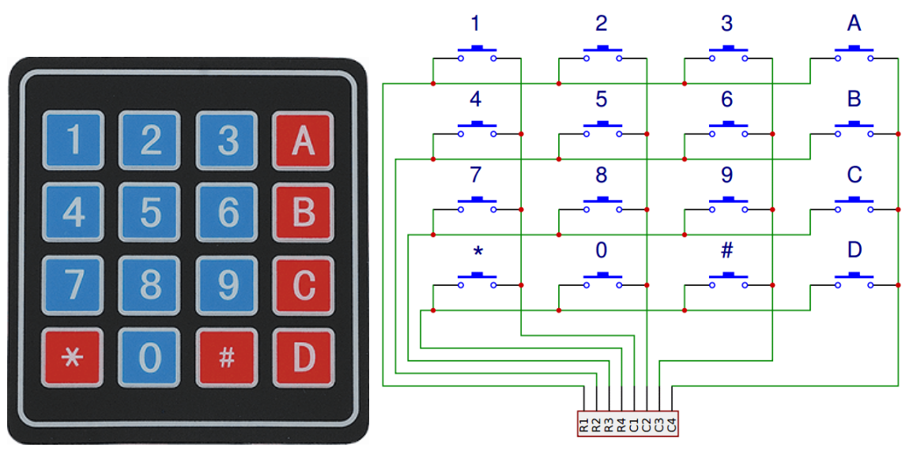
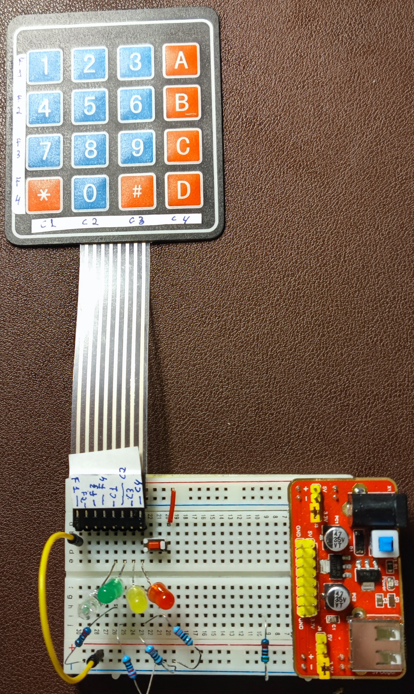
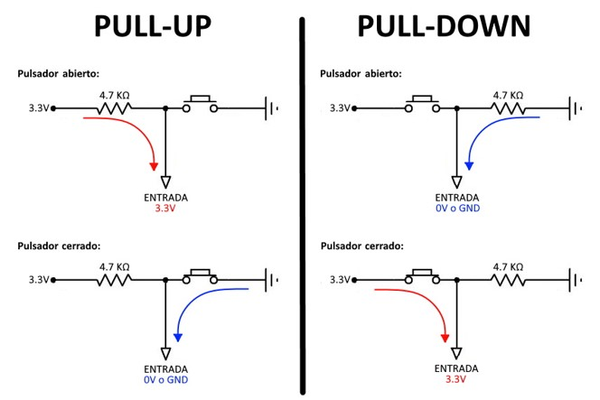
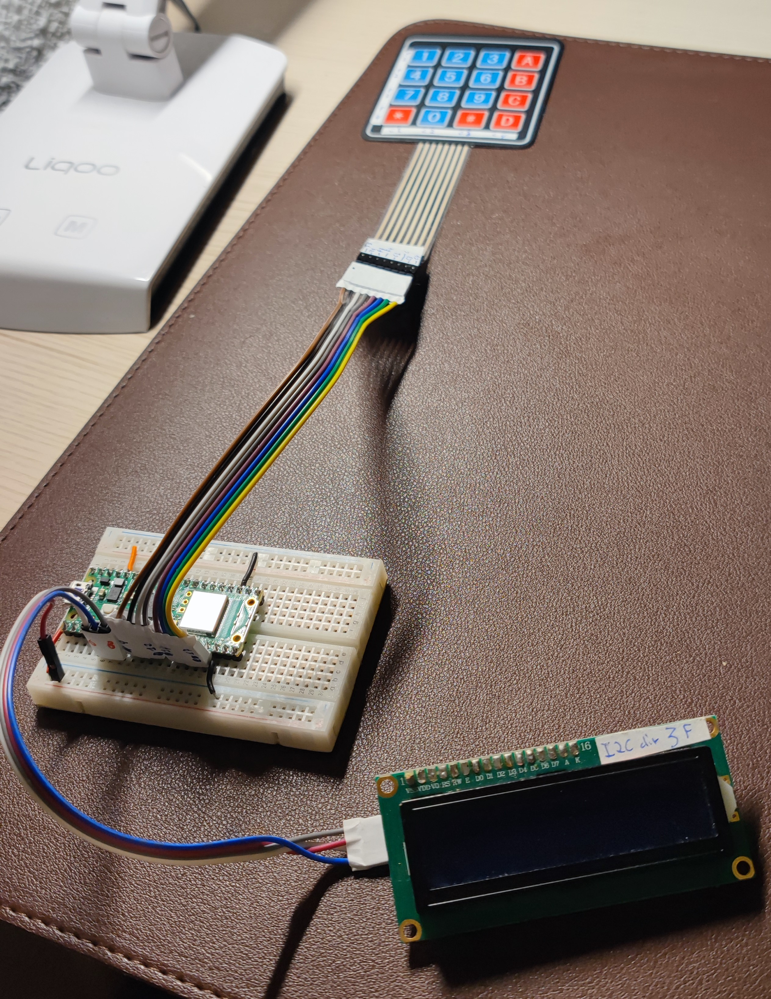
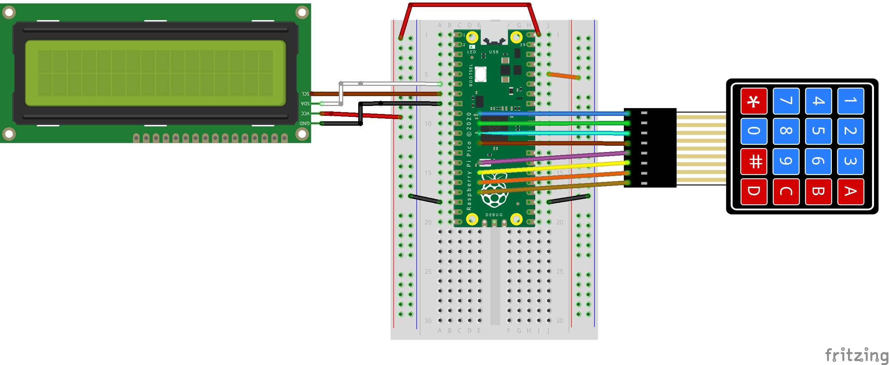

# CL7 HW de entrada para displays> Teclado 4x4-  PyR 2024_25 CMM BML

## Objetivo de la serie de clases

Vamos a ir elaborando clases con Hw de entrada por humanos, que sea mas adecuado para combinar con Displays, como por ejemplo:

- Pulsadores momentáneos e interruptores deslizantes  ( modelo universal) 

- **CL6- Sensores Táctiles tipo MPR121 (hecho)**

- Codificadores rotativos

- Mandos a distancia por IR ( el que viene en el kit de sunfounder y la mayoría de los kits)

- **Teclado 4 x 4 ( esta clase)**

## Clase 7: Teclado 4 x 4 - Indice - xx minutos

- Resumen : Tutoriales, Programas y Donde ampliar / afianzar

- Introducción y objetivos
  
  - ¿Por que empezar con 4x4 y no con pulsador?
  
  -   Aprender a adaptar los tutoriales de SF

- Montaje SIN microcontrolador y Explicación de HW + Pull-up / down
  
  - Entenderemos como funciona el algoritmo del programa
  
  - Entenderemos por que se emplean las resistencias de pull-up y pull-down

- Montaje CON uC, Prototipos basados en la demo de Sunfounder
  
  - 0.0 y 1.0 : Tal cual -> cambios en pines y pull-down
  
  - Versiones 2.0 , 2.1 y 2.2 : Mejoras 1,2,3 y 4
  
  - Versiones teclado 4x4 + LCD : 3.0 y 3.1

- Conceptos cubiertos en este capitulo

- Preguntas sobre la Clase 1 - 10 minutos

## Resumen : Tutoriales, Programas y Donde ampliar / afianzar

### Tutoriales resumen

**En Ingles** **Sun Founder** 

[4.2 4x4 Keypad &mdash; SunFounder Kepler Kit for Raspberry Pi Pico W 1.0 documentation](https://docs.sunfounder.com/projects/kepler-kit/en/latest/pyproject/py_keypad.html)

### 

### Tabla resumen de programas

| Programa                                               | Lenguaje | HW- Notas                                | Objetivo                                                                                 |
| ------------------------------------------------------ | -------- | ---------------------------------------- | ---------------------------------------------------------------------------------------- |
| [4.2_4x4_keypad.py](4.2_4x4_keypad.py)                 | uPy      | Original de sunfounder tal cual          | **NO funciona con nuestro montaje**                                                      |
| [R2425CL7_K4x4SF0_0.py](R2425CL7_K4x4SF0_0.py)         | uPy      | Original SF con cambio pines y pull-down | Funcionará con nuestro montaje, cambian los GPIOs                                        |
| [R2425CL7_K4x4SF1_0.py](R2425CL7_K4x4SF1_0.py)         | uPy      | original SF limpio                       | Sin repetición                                                                           |
| [R2425CL7_K4x4SF2_0.py](R2425CL7_K4x4SF2_0.py)         | uPy      |                                          | Mejoras 1 y 2: belleza de codigo + repeticion                                            |
| [R2425CL7_K4x4SF2_1.py](R2425CL7_K4x4SF2_1.py)         | uPy      |                                          | Mejora 3: continue -> if else                                                            |
| [R2425CL7_K4x4SF2_2.py](R2425CL7_K4x4SF2_2.py)         | uPy      |                                          | Mejora 4: Variable `actualteclas` de lista a string para print, y luego LCD              |
| [R2425CL7_K4x4SF_LCD3.py](R2425CL7_K4x4SF_LCD3.py)     | uPy      | + LCD en GPIO 4&5                        | Mejora 5: incorporar LCD , salida por LCD de teclas pulsadas                             |
| [R2425CL7_K4x4SF_LCD3_1.py](R2425CL7_K4x4SF_LCD3_1.py) | uPy      | + LCD en GPIO 4&5                        | Mejora 6: incorporar LCD -> borra pantalla si llega al final escribiendo teclas pulsadas |

### Donde ampliar / afianzar

Ver tutorial Sunfounder 

Otra implementación posible de un buen maker es : 

 Video demo **Kevin mcaller**     [4x4 Keypads, Raspberry Pi Pico and MicroPython - YouTube](https://youtu.be/EpvVYyKwfjs?si=Gpu4WnQMisI2EIz8)

Incluye una libreria con 'timer' que de momento es de un nivel superior al del nivel medio de la clase

## Introducción y objetivos

### ¿Por que empezar con 4x4 y no con un pulsador?

Lógicamente el objetivo es aprender a usar un teclado 4x4, pero hay que explicar porque no comenzamos con un botón pulsador. Normalmente en los curso de uC se comienza con los dispositivos de entrada con los pulsadores momentáneos o en ingles switch o button Que vienen en todos los kits. Echa, por favor, un vistazo a la presentación de estos componentes en el tuto de sunfounder para reconocerlos y luego volvemos aqui

[Button &mdash; SunFounder Kepler Kit for Raspberry Pi Pico W 1.0 documentation](https://docs.sunfounder.com/projects/kepler-kit/en/latest/component/component_button.html)

El problema de empezar con los pulsadores, es que se suelen usar con programas donde **el pulsador es un elemento "activo" y eso complica mucho las cosas** teniendo que implementar:

- Debouncing : manejo de rebotes

- Timers, temporizadores

- Interrupciones

- Hilos en 'cores' del uC : los microcontroladores Pico y Pico W, basados en RP2040 tienen 2 cores

**Esto desanima a los principiantes** con complejidades no estrictamente necesarias, al principio => mostrar ejemplo del libro "Get started with MicroPython on Raspberry Pi Pico" cap 5

He preferido un **comienzo más 'suave'** asi que en esta lección **usaremos el teclado 4x4, que es equivalente a 16 pulsadores, pero se manejará en este tutorial de manera PASIVA:**

El programa en uPy consulta el estado de un pulsador periódicamente, pero no "deja" al pulsador ningún control en el programa

### Aprender a adaptar los tutoriales de Sunfounder

Los tutoriales de los kits son normalmente el punto de partida para aprender, pero es raro que no haya que modificarlos por:

1. Hay que cambiar los GPIOS: Los pines usados propuestos en el tuto los usamos para otro HW, que querríamos usar de forma conjunta en ele futuro: usar key4x4 con LCD

2. El lenguaje es un uPython antiguo ( no f-string por ejemplo) 

3. Faltan comentarios y la cabecera informativa

4. Modificamos el HW ligeramente: en nuestro caso no usamos resistencias de pull-down

5. En algunos casos, el codigo es de mala calidad aunque funcional, solo sirve para demostrar que el HW implicado funciona. Mala calidfad = NO se puede usar en montajes combinados con otro HW o es ineficiente o lento

## Montaje SIN microcontrolador y Explicación de HW

La explicación de como funciona el HW del teclado la encontramos en el wiki de sunfounder

https://docs.sunfounder.com/projects/kepler-kit/es/latest/component/component_keypad.html



En el programa en uPy, usaremos un algoritmo pasivo de escaneo que funciona de la siguiente manera:

1. Las líneas 'Rx' son las filas de la matriz de pulsadores del dibujo , y 'Cx' las columnas

2. Todas las líneas Cx seran entradas para el uC y se inicializan a '0' con un pull-down ( luego lo explicamos) , de forma que si no se hace nada leeremos '0' en los puntos Cx

3. Imaginemos que esta pulsado el '6' y el '9'

4. Inyectamos un '1' ( +3.3 volt) por en R1 y leemos en orden
   
   1. C1 => 0 NO esta pulsado el '1'
   
   2. C2 => 0 No esta pulsado el '2'
   
   3. C3 => 0 No esta pulsado el '3'
   
   4. C4 => 0 No esta pulsado el 'A'

5. Inyectamos un '1' ( +3.3 volt) por en R2 y leemos en orden
   
   1. C1 => 0 NO esta pulsado el '4'
   
   2. C2 => 0 etc
   
   3. C3 = >**'1' , entendemos que esta pulsado el '6'**
   
   4. C4 => 0

6. Inyectamos un '1' ( +3.3 volt) por en R3 y leemos en orden
   
   1. C1 => 0
   
   2. C2 => 0
   
   3. C3 = > **'1' , entendemos que esta pulsado el '9'**
   
   4. C4 => '0'

7. Inyectamos un '1' ( +3.3 volt) por en R4 y leemos en orden
   
   1. C1 => 0
   
   2. C2 => 0
   
   3. C3 = > 0
   
   4. C4 => 0

Vamos a probar este algoritmo con un montaje SIN microcontrolador, donde tendremos que ir modificando el cableado para inyectar los '1' en cada fila y la tecla pulsada de cada fila se vera en 1 de los 4 leds (que representan las 4 posiciones de columna)  El pulsador rojo es solo para testear que el led rojo esta Ok



### Pull-up y pull-down

Queda por explicar el concepto de pull-up o pull-down. Veámoslo con un circuito con un pulsador



Fijémonos el el dibujo de pull-Down, e imagina que la resistencia de pull-down NO está: si se deja un Pin de entrada en el microcontrolador, sin conectar con el pulsador abierto, el Pin queda un estado de alta impedancia o flotante, en el que cualquier interferencia o perturbación puede modificar el estado del Pin.
**Solución** : conectar una resistencia de pull-up o pull-down ver figuras
Normalmente se usa una resistencia de 10k o 4,7k ( considerando el circuito RC que se forma y la rapidez de las señales – no lo voy a explicar )

En el Pico o PicoW usamos las resistencias internas del chip RP2040 ( que tiene valores de entre 50 y 80k), que están pensadas para este fin y no hay que añadir nada.

**Solo hay que inicializar los pines de forma adecuada**

`col[i] = machine.Pin(pin[i], machine.Pin.IN, machine.Pin.PULL_DOWN)`

ATENCION : en el Pico 2 y Pico 2 W ha habido un problema con los lotes 'A' y las resistencias de pull-Dow internas no estan correctas . Se recomiendo unas resistencias externas

[A Surprise Hardware Bug in Raspberry Pi&#39;s RP2350 Leads to Unexpected Pull-Down Behavior - Hackster.io](https://www.hackster.io/news/a-surprise-hardware-bug-in-raspberry-pi-s-rp2350-leads-to-unexpected-pull-down-behavior-76b51ec22ede)

No esta claro cuando esta corregido

## Montaje CON uC, Prototipos basados en la demo de SF

### Versiones 0.0  y  versión base = 1.0

Bajamos el codigo de SF y vemos su montaje HW

 [4.2_4x4_keypad.py](4.2_4x4_keypad.py)

y vemos su montaje HW

[Montaje HW SF]([4.2 4x4 Keypad &mdash; SunFounder Kepler Kit for Raspberry Pi Pico W 1.0 documentation](https://docs.sunfounder.com/projects/kepler-kit/en/latest/pyproject/py_keypad.html#py-keypad))

**Problema 1:** queremos usar el LCD en los pines GPIO4 y GPIO5, pero en el montaje de SF del 4x4 los esta usando para el teclado 4x4

**Solucion 1**: mover los pines del teclado 4x4

y añadimos

**Problema 2:** usa pull-down externos que son innecesarios en los 4 pines para las columnas

**Solución 2**: modificar el codigo al inicializar los pines columna y usar pull-down internos del uC 

Con esto obtenemos la version 0.0, porque no hemos cambiado nada sustancial

[R2425CL7_K4x4SF0_0.py](R2425CL7_K4x4SF0_0.py)

Pero como digo siempre, los programas han de estar documentados y comentados asi que, he documentado mejor la 0.0 ==> 1.0 

**Programa Base :** [R2425CL7_K4x4SF1_0.py](R2425CL7_K4x4SF1_0.py)

lo estudiamos en detalle usando los comentarios

### Versiones 2.0 , 2.1 y 2.2

#### **Mejora1 y Mejora 2 :** [R2425CL7_K4x4SF2_0.py](R2425CL7_K4x4SF2_0.py)

lo estudiamos en detalle usando los comentarios:

**Mejora 2**: añadimos la funcionalidad de repetición, si una tecla sigue pulsada durante mas de un tiempo (500 ms parece razonable) , se considera que es como una tecla nueva 

    **Algoritmo Mej2**: medimos el tiempo guardando una variable con last_time, cuando medimos otra vez calculamos la diferencia con `ticks_diff(ticks_ms(), last_time) > TIMEREPEAT`

    **Nota** : es mejor ticks_diff(ticks_ms(), last_time) que una simple resta , porque los contadores de tiempo tienen un numero de bits limitado, y se puede producir desbordamiento. Es un poco tecnico, en resumen es sustituir la resta normal por la resta con aritmética de modulo o mas propiamente de anillo

**Mejoras 1**: es un conjunto de mejoras de  'belleza' de codigo. La mas complicada es 

Cambiar 

```
fpines = [6,7,8,9] # numeros de identificacion de GPIOS de filas, NO son objetos pines, solo numeros
cpines = [10,11,12,13] # numeros identificacion de GPIOS de columnsa

filaPines = [None, None, None, None] # esto crea un alista vacio de 4 elementos
colPines = [None, None, None, None] # idem
for i in range(4): # creacion de los objetos pines x 4 x 2
    filaPines[i] = Pin(fpines[i], Pin.OUT) # las filas inyectan 0 o 1
    colPines[i] = Pin(cpines[i], Pin.IN, Pin.PULL_DOWN) # en las columnas leemos 0 o 1,
    # pull-dow activado es decir por defecto leeremos '0'
```

por 

```
# Mejora 1 : set pins for rows as outputs
filaPines = [Pin(fpin, mode=Pin.OUT) for fpin in fpines] 

# set pins for cols as inputs with pull-down
colPines = [Pin(cpin, mode=Pin.IN, pull=Pin.PULL_DOWN) for cpin in cpines]
```

Se denomina list comprehension, ver el libro de python

[List-comprehension-python](https://ellibrodepython.com/list-comprehension-python)

#### **Mejora3  :** [R2425CL7_K4x4SF2_1.py](R2425CL7_K4x4SF2_1.py)

continue -> if else

#### **Mejora 4 :** [R2425CL7_K4x4SF2_2.py](R2425CL7_K4x4SF2_2.py)

Variable `actualteclas` de lista a string

### Versiones teclado 4x4 + LCD : 3.0  y 3.1

#### Foto



#### Montaje



#### **Mejora 5 :** [R2425CL7_K4x4SF_LCD3.py](R2425CL7_K4x4SF_LCD3.py)

    Variable `actualteclas` de lista a string -> incorporar LCD

#### **Mejora 6 :** [R2425CL7_K4x4SF_LCD3_1.py](R2425CL7_K4x4SF_LCD3_1.py)

     incorporar LCD -> borra pantalla si llega al final

## Conceptos cubiertos en este capitulo - 5'

En esta clase hemos cubierto los siguientes conceptos de Robotica / micropython: 

- Pull-up y pull-down : preferible uso de pull-up y down internos de Pico
- Adaptación de demos del kit + documentar
- Algoritmos de repetición con contadores de tiempo y restar marcas de tiempo
- Listas uso practico
- List comprehension
- cambiar un continue -> if else , que mejora la limpieza del codigo
- **Pulsadores momentáneos por scan periódico**

## Sección para que los alumnos pregunten sus dudas durante la clase

---

TO DO :  Timer en vez de scaneo periódico 

- con 1 solo pulsador scaneado en pasivo

- con 4x4 pulsadores 
