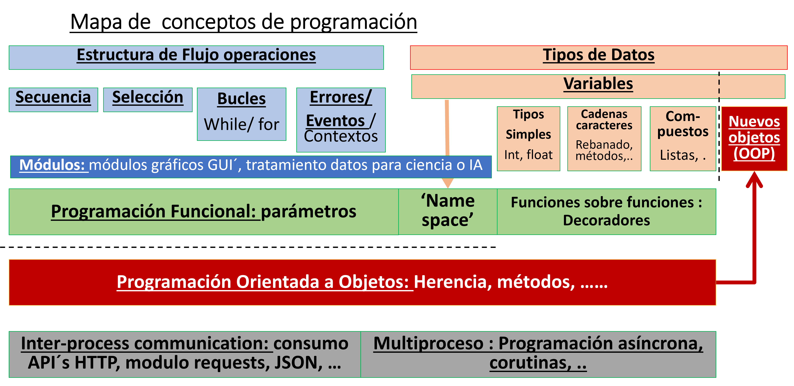

# CL8 - Python : bucles For y tipos: cadena, tupla y Lista - PyR 2024_25 CMM BML

## Clase 8 - Indice - 90 minutos

-  

- 

## Tutoriales y Programas que vamos a seguir

### Tutoriales resumen

----

### Tabla resumen de programas

| Programa | Lenguaje | Objetivo de Aprendizaje |
| -------- | -------- | ----------------------- |
|          | Py       |                         |
|          | Py       |                         |
|          | Py       |                         |
|          | Py       |                         |

### Recomendaciones de estudio despues de la clase

Leer Libro de python

---

### Punto de situación en el Mapa de conceptos de Programación

 

Abordaremos la zona azul clara de Flujo de operaciones: for y la zona naranja de tipos de datos 

## Cadenas - ver pdf cadenas

### For y Tuplas - ver pdf for y tuplas

### Listas - ver pdf Listas

## Preguntas sobre la Clase 8 - 10 minutos

Sección para que los alumnos pregunten sus dudas durante la clase

---

TO DO :
