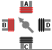
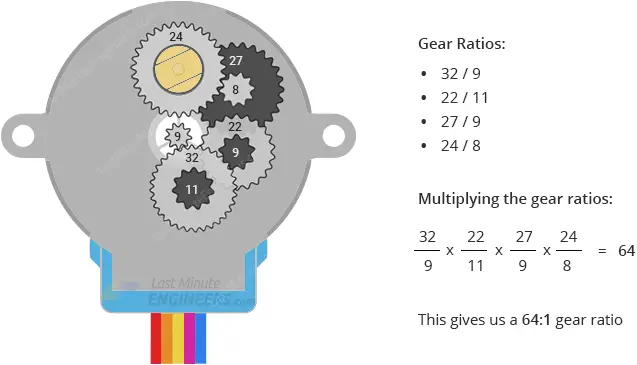
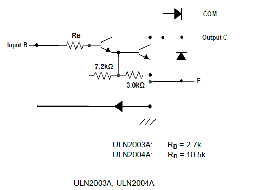
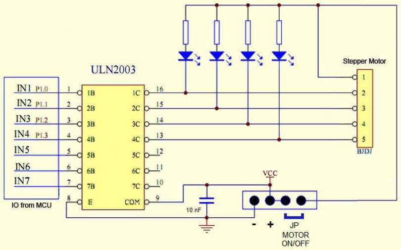

# Spanish (Trabajo en proceso)

## Objetivo

En esta clase, vamos a estudiar los **motores Paso a Paso o Steeper.**

**Teoría :** Dado que hay muchísimos tutoriales sobre el tema, no vamos a desarrollar mucho la teoría solo consultar 1 o 2 tutoriales.

**Programas:** <u>Se construirá un programa básico con todas las opciones de tipos de pasos</u> ( ver mas adelante), pero no se hará un programa complejo, ni se construirá una libreria, dejando esto a los alumnos

## <u>Teoría de Motores Paso a Paso </u>

### Para entender el HW del motor

[Motores paso a paso &#8211; Prometec](https://www.prometec.net/motores-paso-a-paso/)

Resumen : Un **motor paso a paso** es parecido a los motores de continua, pero en lugar de montar un sistema de asegurarnos de que siempre hay una bobina fuera del equilibrio, en un **motor paso a paso** montamos un sistema de varias bobinas que garantizan que solo se mueve la distancia (O paso) entre las bobinas contiguas.



[In-Depth: Control 28BYJ-48 Stepper Motor with ULN2003 Driver &amp; Arduino](https://lastminuteengineers.com/28byj48-stepper-motor-arduino-tutorial/?utm_content=cmp-true)

Es un tutorial excelente, con explicaciones detalladas de como funciona tanto el motor como el controlador (leer solo ahsta codigo Arduino)

#### Entendiendo el numero de pasos por giro

**ATENCION**: **la figura de las 4 fases que completan el circulo ( 360º) NO es correcta** y lleva a confusión, cuando se pretende entender el numero de pasos de 1 giro completo. Leyendo con calma el tutorial, indica que 

*'when the 28BYJ-48 motor is operated in full-step mode, each step corresponds to a rotation of 11.25°. This means there are 32 steps per revolution (360°/11.25° = 32).'*

Es decir, **en full-step** significa energizar cada una de las 4 x fases 1 vez cada paso, luego un giro es ejecutar la secuencia de 4 paso  x 8 veces = **32 pasos de 11.25º**

**En modo Half-step** se recorren las 4 fases en 8 pasos, luego un giro corresponde a 8 x 8  = **64 pasos = > 5.625º**

**ADEMAS, hay una reductora 1/64**, por lo que en 

Full-Step = 32 * 64 = 2048 pasos por giro , o 0,18º por paso

Half-step = 64 * 64 = 4096 pasos por giro , o 0,09º por paso



### 

### Controladora ULN2003

El motor requiere un consumo elevado 240 mA, por lo que necesitamos un "driver" que proporcione los mA requeridos pudiendo ser controlado por niveles logicos a 3.3. El ULN2003a proporciona 500mA por salida con un voltaje máximo de 50volt.

ULN2003  empaqueta 7 pares de transistores en montaje Darlington



Lo que se suele vender como driver ULN2003, añade algo de circuitería y simplifica las conexiones. Supuestamente  los 4 leds facilitan el aprendizaje de los pasos, pero dado que la secuencia corre a mucha velocidad, sirven de poco. Se puede usar el integrado ULN2003 directamente pinchándolo en la protoboard.



## <u>Practica de aprendizaje con motores PaP</u>

### Tabla resumen de programas

| Programa                                                         | HW                                            | Funcionalidad                                                             |
| ---------------------------------------------------------------- | --------------------------------------------- | ------------------------------------------------------------------------- |
| [pico_stepM_simple.py](pico_stepM_simple.py)                     | ULN2003   IN1-GPIO10 ...           IN4-GPIO13 | Stepper simple - check motor with conservative parameters                 |
| [pico_stepM_simple_2_0.py](pico_stepM_simple_2_0.py)             | idem                                          | Stepper simple - check ALL modes and delays by manual input               |
| [pico_stepM_1giro__3_0.py](pico_stepM_1giro__3_0.py)             | idem                                          | Stepper 1 x 360 º in 3 param -> meassure lap time & number stepps per lap |
| [pico_stepM_FspinGrade_ex1_0.py](pico_stepM_FspinGrade_ex1_0.py) | idem                                          | Stepper Motor managed by a function with all parameters- Example          |

### Alimentación y Consumo

Estos motores tienen un consumo relativamente elevado: **Típico =  240mA**

### Libreria/s

No vamos a usar libreria.

### Conexionado usado en los Test

| pin # PICO | Pin Logico en PICO | ULN2003           |
| ---------- | ------------------ | ----------------- |
| 40         | VBUS o +5volt      | (5--12volt) pin + |
| 13         | GND                | (5--12volt) pin - |
| 14         | GPIO10             | IN1               |
| 15         | GPIO11             | IN2               |
| 16         | GPIO12             | IN3               |
| 17         | GPIO13             | IN4               |

### Tutoriales en micropython

[Interface 28BYJ-48 Stepper Motor with ESP32 using MicroPython](https://microcontrollerslab.com/28byj-48-stepper-motor-esp32-micropython/)

[Motores Paso a Paso (PaP) MicroPython- [Raspberry Pi Pico/ESP]](https://controlautomaticoeducacion.com/micropython/motores-paso-a-paso-pap/)

En todos los tutoriales la idea es usar 4 pines digitales activándolos o desactivándolos en la secuencia adecuada

### Programa 1 - pico_stepM_simple.py

Seria el **test mas básico** de estos motores y seria el primero a usar para probar un motor recien comprado. **Usamos una secuencia de medio-paso**, porque es mas facil que funcione (¡creedme!) : el parámetro 'delay entre pasos' es critico por eso se toma un valor conservador. La alimentación en half mode puede ser también mas baja, que en otros modos por lo que es mas probable que funcione si teneis probelmas de alimentacion

La secuencia de medio paso la definimos de golpe en una lista

```
half_step_sequence = [
    [1,0,0,0],
    [1,1,0,0],
    [0,1,0,0],
    [0,1,1,0],
    [0,0,1,0],
    [0,0,1,1],
    [0,0,0,1],
    [1,0,0,1],
    ]
```

(otra opción mas compleja, seria ir generando esta secuencia a medida que recorremos un bucle, pero creo que esta opcion es mas sencilla y rápida)

### Programa 2 - pico_stepM_in_mode_del_2_0.py

Vamos a ver como funcionan todos los modos posibles Clockwise y Counter Clock Wise, con diferentes parámetros de Delay.

| Mode    | Tipo modo           | Delay minimo        |
| ------- | --------------------| ------------------- |
| FULL1S  | 1 Paso 1 bobina CW  | 500 micro segundos  |
| FULL1Sr | 1 Paso 1 bobina CCW | 500  usec           |
| FULL2S  | 1 Paso 2 bobinas CW | 450  usec           |
| FULL2Sr | 1 Paso 2 bobina CCW | 450  usec           |
| HALF    | Medio paso CW       | 180 usec-> usar 200 |
| HALFr   | Medio paso CCW      | 180 usec-> usar 200 |

### Programa 3 - pico_stepM_1giro_3_0.py

Desencriptando los tutoriales, se ve que el numero de secuencias completas para un giro de 360º es de 64 * 8 => 64 viene de la reductora y los 8 debe ser por que cada una de las 4 bobinas esta 'clonada' 8 veces a lo largo del circulo del motor.

El programa 'pico_stepM_1giro_3_0.py' hace estas asunciones y debe dar un giro completo. Si no es vuestro caso, vuestro motor tendrá diferencias construcctivas a estudiar.

Se pueden estudiar en los 6 modos posibles las velocidades que da el usar diferentes 'delays'. La velocidad maxima esta alrededor de los 16 RPM


### Programa 4 - pico_stepM_FspinGrade_ex1_0.py

Aqui la idea es definir una función para mover el motor que incluya todos los parámetros : 
- pinlist : lista de los 4 pines usado por las 4 fases del motor ( no tienen que ir seguidos, pero es visual)
- grad : giro deseado en grados  0- 360 (int)
- modStep : modo FULL1S, FULL2S, HALF (str) 
- vel : velocidad 100 = minimo retardo entre pasos (int)
- CCW : direccion de giro como boolean True = counter clock wise, 
- Debug : muestra info de debug (boolean)
---

TO DO :  Hacer una libreria con una clase StepperMotor, ver ejemplo2 de upython para ver funciones típicas
