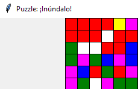

# Primeros pasos con GUI Zero

## Objetivo

En esta clase, vamos a estudiar como '**Crear GUI´s con guizero'**, que forma parte de un proyecto macro de visualización de API´s.

Recuerdo que ya vimos en la CL29:

- <u>Aprender a trabajar con JSON en Python</u>

- <u>Explotar los datos open source por medio de API´s</u> del Ayuntamiento de Madrid y/ o AEMT - primeros pasos

Quedaría por decidir si hacemos el proyecto en micropython + display tipi ILI9341 o en una raspberry pi en python con guizero

### Libro que vamos a seguir y documentacion

'***Create Graphical User Interfaces with Python***' by Laura Sach & Martin O’Hanlon
How to build windows, buttons, and widgets for your Python projects

[El libro esta disponible para descargar desde el repositorio de la revista  Magic Pi ](https://magpi.raspberrypi.com/books/create-guis). Por comodidad también se puede descargar en este repositorio

**Los programas estan disponibles** en el repositorio de github

[GitHub - themagpimag/createguis](https://github.com/themagpimag/createguis)

Una **extensa documentación sobre el uso de GUIzero** esta disponible en este repositorio creado con Mkdocs

[guizero](https://lawsie.github.io/guizero/)

### Tabla resumen de programas

| Programa                                                                            | Widget                          | Capitulo del libro | Objetivo de Aprendizaje                                                                                                                |
| ----------------------------------------------------------------------------------- | ------------------------------- |:------------------:| -------------------------------------------------------------------------------------------------------------------------------------- |
| [ch1-1.py](ch1-1.py)                                                                | App                             | ch1                | El programa mas básico posible                                                                                                         |
| [BMMP_CL30_GZch1hola_1_0.py](BMMP_CL30_GZch1hola_1_0.py)                            | App                             | ch1                | primeros paso - crear una ventana                                                                                                      |
| [BMMP_CL30_GZch2wanted_1_0.py](BMMP_CL30_GZch2wanted_1_0.py)                        | Text, Picture                   | ch2                | Reproduce un cartel típico de 'se busca'                                                                                               |
| [BMMP_CL30_GZch3spy_1_0.py](BMMP_CL30_GZch3spy_1_0.py)                              | PushButton                      | ch3                | Genera nombres de espía al pulsar un botón en la ventana                                                                               |
| [BMMP_CL30_GZch4meme_1_0.py](BMMP_CL30_GZch4meme_1_0.py)                            | TextBox, Drawing, Combo, Slider | ch4                | Crea dibujos de memes con texto a escribir por el usuario , arriba y abajo , asi como elegir entre diferentes colores y tipos de letra |
| [ch5-1.py](ch5-1.py) [ch5-3.py](ch5-3.py) [ch5-4.py](ch5-4.py) [ch5-5.py](ch5-5.py) |                                 | ch5                | Los programas 1, 3, 4, y 5 son ejemplos de lo que No se debe hacer.                                                                    |
| [ch5-2.py](ch5-2.py)                                                                | 2-método .repeat(..)            | ch5                | Interesa el ejemplo 2,                                                                                                                 |
| [ch5-6.py](ch5-6.py)                                                                | 6-Segunda ventana               | ch5                | Ejemplo simple de tener una 2da ventana                                                                                                |
| [ch5-7.py](ch5-7.py)                                                                | 7-método i.info()               | ch5                |                                                                                                                                        |
| [ch5-8.py](ch5-8.py)                                                                | 8- metodos yesno, info , error  | ch5                |                                                                                                                                        |
| [BMMP_CL30_GZch6_3nr_1_0.py](BMMP_CL30_GZch6_3nr_1_0.py)                            | Box                             | ch6                | Crea un panel para jugar a 3 en Raya, no tiene inteligencia de juego salvo detectar ganador                                            |
| [BMMP_CL30_GZch7_mataPun_1_0.py](BMMP_CL30_GZch7_mataPun_1_0.py)                    | Waffle                          | ch7                |                                                                                                                                        |
| [BMMP_CL30_GZch8_inundalo_2_0.py](BMMP_CL30_GZch8_inundalo_2_0.py)                  | Waffle                          | ch8                | Juego visual de inundar un tablero de colores                                                                                          |
| [BMMP_CL30_GZch8_inundalo_2_t2.py](BMMP_CL30_GZch8_inundalo_2_t2.py)                | Recursividad                    | ch8                | Mismo juego, pero con trazas para ver recorrido recursivo                                                                              |

### Recomendaciones de estudio

El libro es excelente y auto explicativo, con lo que habría poco que explicar en esta tutorial. Sin embargo esta pensado para una destinatario joven que quiere hacer apps rápido sin preocuparse de aprender sólidamente los conceptos.

Recomiendo :

1. Hacer el ejemplo del libro => el programa adjunto de este repositorio

2. Profundizar en los conceptos en la web de documentación

Normalmente se hará un programa por capitulo incluyendo todas las partes que a veces en el capitulo se ven paso a paso

### **Capitulo 1.1 - Instalación**

#### Instalación Windows - Thonny

Instalar la libreria con Thonny es lo mas sencillo, aparte de las opciones que da el libro o las que indica en la documentación en [guizero- installation](https://lawsie.github.io/guizero/#installation)


#### Instalación Raspberry Pi - App-get install

Se instala sin problemas siguiendo la instrucciones de [guizero install raspberry-pi](https://lawsie.github.io/guizero/#raspberry-pi) , probado el 25Abril 2024 en Raspberry pi 3B.

##### Instalacion y actualizacion

IMPORTANTE : con apt-get install me instalo la version 1.1 de guizero. Luego ejecute 

```
pip3 install guizero --upgrade
```

y se actualizo a versión 1.5 ( que es la ultima en este momento)

##### Prueba en RPI 3b

Probé varios programas hechos en esta guía y todo fue Ok . Los probé con el IDE de Thonny de la RPI

### **Capitulo 1 - Hola mundo / widget = App**

Nota: widget no tiene una traducción directa, se podría decir que es una mini-aplicación, dentro de una aplicación mas grande

0- El programa mas simple posible

[ch1-1.py](ch1-1.py)

```
from guizero import App
app = App()
app.display()
```

1- Haz el programa del capitulo 1 o ejecuta el programa

[BMMP_CL30_GZch1hola_1_0.py](BMMP_CL30_GZch1hola_1_0.py)

2- Recomiendo leer el principio de  [Using Widgets - guizero](https://lawsie.github.io/guizero/usingwidgets/). Resumen:

- Cada app de guizero necesita una [App](https://lawsie.github.io/guizero/app/) widget => será la ventana principal

- Cada widget que se añada ha de referenciarse a la app

- Importa solo los widgets que necesites

```
from guizero import App, Text, PushButton, Slider
```

- Al final debe haber una instrucción para mostrar la app, como en el ejemplo ch1 : **`aplicacion.display()`**

```
aplicacion = App(title="Hola Mundo JCSP")
message = Text(aplicacion, text="Bienvenido a la app")
aplicacion.display()
```

- Todo lo que aparece en la GUI son widget : text boxes, buttons, sliders ...

- **Todos los widgets**  van entre la línea que crea la app y la linea `app.display()` 

### Capitulo 2 / widget = Text, Picture

1- Haz el programa del capitulo 2 o ejecuta el programa

[BMMP_CL30_GZch2wanted_1_0.py](BMMP_CL30_GZch2wanted_1_0.py)

2- Recomiendo **profundizar un poco en el widget 'App'** leyendo la documentación [App - guizero](https://lawsie.github.io/guizero/app/). Para este programa ch2 resumo algunas informaciones :

- La ventana que se crea por defecto con  `aplicacion = App()` es de 500 x 500

- Ningún parámetro en la creación de App es obligatorio

- A posteriori de la creación se puede cambia cualquier valor de los parámetros de creación , que ahora serán propiedades , ejemplo para cambiar a posteriori el color de fondo

```
aplicacion.bg = "#1CE0D6"
```

3- Recomiendo profundizar un poco en el **widget Text** [Text - guizero](https://lawsie.github.io/guizero/text/) . Resumen:

- Es obligatorio incluir un paramento con el "master" = el contenedor al que el widget pertenece : el nombre de la app creada con `App`

- La alineación por defecto = None = "top"

- A posteriori de la adición del widget Text, se puede cambiar cualquier valor de los parámetros de creación , que ahora serán propiedades , ejemplo

```
wanted_text.text_size = 50
wanted_text.font = "Bodoni MT"
```

Nota: el tamaño del texto como parámetro es 'size', pero como propiedad es 'text_size'

4- Recomiendo profundizar un poco en el **widget Picture** [Picture - guizero](https://lawsie.github.io/guizero/picture/)

- Es obligatorio incluir un paramento con el "master" = el contenedor al que el widget pertenece : el nombre de la app creada con `App`

- El nombre del fichero debe incluir el path

`picture = Picture(app, image="images/test.gif")`

- Se soportan imágenes GIF y PNG por defecto. Otros tipos de imagen requieren instalar un paquete adicional

### Capitulo 3 - Sugerir nombre de espía / widgets = PushButton

1- Haz el programa del capitulo 3 o ejecuta el programa

[BMMP_CL30_GZch3spy_1_0.py](BMMP_CL30_GZch3spy_1_0.py)

2- Recomiendo **profundizar un poco en el widget 'PushButton'** leyendo la documentación [PushButton - guizero](https://lawsie.github.io/guizero/pushbutton/) . Para este programa ch3 resumo algunas informaciones :

- El widget  `PushButton` muestra un boton con texto o una imagen dentro, y al ser presionado llama a una función.

- Es obligatorio incluir un paramento con el "master" = el contenedor al que el widget pertenece : el nombre de la app creada con `App`

- El parámetro de función a llamar es como la llamada de una función de interrupción

- **NO ENTIENDO** porque para devolver el valor a un widget Text, no se declara la variable como global al final de la función

```
def choose_name():
    print("Button was pressed")
    first_names = ["Rafa", "Fernando", "Begoña", "Jose", "Carlos", "Gema"]
    last_names = ["Garcia", "Perez", "Sanchez", "Gomez", "Anton", "Martin"]
    spy_name = choice(first_names) + " " + choice(last_names)
    print(spy_name)
    name.value = spy_name # no entiendo porque no hay que definirla como Global !!!
```

- Se soportan imágenes GIF y PNG por defecto. Otros tipos de imagen requieren instalar un paquete adicional

### Capitulo 4 - Crear memes / widgets = TextBox, Drawing, Combo, Slider

1- Haz el programa del capitulo 4 o ejecuta el programa

[BMMP_CL30_GZch4meme_1_0.py](BMMP_CL30_GZch4meme_1_0.py)

El programa tiene 1 App master y 6 widgets = 2 TextBox + 2 Combo + 1 Slider + 1 Drawing

Cada cambio en los widgets : 2 TextBox + 2 Combo + 1 Slider, llama a una función de re-pintado del meme, todos a al misma por simplicidad

Cambio en TextBox = escribir otro texto el la caja de texto

Cambio en Combo = seleccionar color o tipo de letra en una lista drop-down

Cambio en el slider = mover el valor de tamaño de texto

2- Recomiendo **profundizar un poco en el widget 'TextBox'** leyendo la documentación [TextBox - guizero](https://lawsie.github.io/guizero/textbox/)   . Resumo:

- Crea una caja de texto donde el usuario puede escribir, seria como un `input` de Python

- Se puede poner un texto inicial en la caja

- Si se añade una función en `command` se ejecuta en los cambios = escribir otro texto el la caja de texto

- Si se añade una función a ejecutar NO DEBE tener argumentos o solo 1. >La documentacion parece decir que el argumento lo tomo de lo introducido en la text box

3- Recomiendo **profundizar un poco en el widget 'Combo'** leyendo la documentación [Combo - guizero](https://lawsie.github.io/guizero/combo/). Resumo:

- Crea un 'drop-down-box' para seleccionar 1 SOLA opción

- Las opciones se proporcionan como Lista entre ' [ ] '. Se puede poner una opcion por defecto

- Si se añade una función en `command` se ejecuta en los cambios = seleccionar otra opción en la lista drop-down

- Si se añade una función a ejecutar NO DEBE tener argumentos o solo 1.  Si tiene 1 argumento se toma la selección actual como argumento

4- Recomiendo **profundizar un poco en el widget 'Slider'** leyendo la documentación [Slider - guizero](https://lawsie.github.io/guizero/slider/). Resumo:

- Muestra una barra horizontal con un dial que se puede desplazar para dar un valor entero entre dos limites

- Si se añade una función en `command` se ejecuta en los cambios = mover el dial

- Argumentos de la función en `command` , la documentación dice que ha de tener un argumento, pero en el ejemplo no tiene y funciona.

5- Recomiendo **profundizar un poco en el widget 'Drawing'** leyendo la documentación [Drawing - guizero](https://lawsie.github.io/guizero/drawing/). Resumo:

- Es como un cajón de sastre para crear figuras geométricas dentro de una ventana: líneas, rectángulos, círculos, polígonos, etc.

- También vuelca imágenes ( como en el ejemplo del capitulo) 

- NO llama a ninguna función, porque la lógica es mas bien diferente :
  
  - Crear el widget Drawing
  
  - Dibijar cosas : lineas, imagenes , etc.
  
  - llamar al master.display()

### Capitulo 5 / metodos .after(), .cancel() y .repeat()

1- El capitulo 5 es un conjunto de programas MAL hechos para aprender. Baja los programas del repositorio y ejecuta 1 a 1 con la explicación del libro

**El programa mas interesante es el ch5-2**, que usa el método repeat()

2- Recomiendo profundizar un poco en los métodos .after(), .cancel() y .repeat() de App  en la documentación [App - guizero](https://lawsie.github.io/guizero/app/). Resumo algunas informaciones :

- Hay un 'scheduler' que se puede programar para que llame a una función
  - A intervalos fijos **.repeat()**
  - Solo una vez despues de un tiempo **.after()**
  - para cancelar la funcion que se llama con **.cancel()**
- El programa ch5-2 tiene problemas según como se salga de el en Thonny. Si se ejecuta en cmd NO hay estos problemas. Esta la opción de incluir 

```
app.when_closed = app.cancel(flash_text)
```

Para cancelar la función que se llama con el 'scheduler'

- Se puede simular repeat() con after() haciendo llamadas recursivas - ver ch 7 programa mataPun

### Capitulo 6 - Panel de juego 3 en raya / widgets = Box y Grid layout

1- Haz el programa del **capitulo 6** o ejecuta el programa

[BMMP_CL30_GZch6_3nr_1_0.py](BMMP_CL30_GZch6_3nr_1_0.py)
[BMMP_CL30_GZch6_3nr_2_0.py](BMMP_CL30_GZch6_3nr_2_0.py)

Es un panel para jugar a las 3 en raya, pero SIN inteligencia: solo detecta el final el juego.

El programa esta construido de una forma algo criptica

1. La parte de INICIALIZACION DE JUEGO seria la parte de programa principal ( sin las funciones) , especialmente la función `clear_board() # Crea el Tablero`

2. El BUCLE DE JUEGO esta en realidad en `def choose_square(x, y): # Es el bucle de juego` que es la funcion de callback que se llama cada vez qeu se clica en uno de los 9 cuadrados tipo PushButton, creados en clear_board(). 

3. El FINAL DE JUEGO se comprueba en `check_win()` que es el ultimo proceso del bucle de juego. Si es final de juego por ganar o empatar  o por completar 9 movimientos, se muestra un mensaje adecuado. ERROR : no cancela los Pushbutton y se puede seguir usándolos despues de ganar. CORREGIDO  en version 2.0 [BMMP_CL30_GZch6_3nr_2_0.py](BMMP_CL30_GZch6_3nr_2_0.py)

2- Recomiendo **profundizar un poco en el widget 'Box'** leyendo la documentación  [Box - guizero](https://lawsie.github.io/guizero/box/) Resumo:

- Es como una caja invisible para contener otros widgets => es un 'master' junto  `App` y  `windows` , normalmente para hacer un layout especial
- En el programa 6 se usa con Grid layout , ver abajo
- Box es muy versátil, y permite hacer cualquier diseño que se quiera, por ejemplo un formulario. Ver ejemplos de uso en [Layouts - guizero](https://lawsie.github.io/guizero/layout/#boxes)

3- Recomiendo **profundizar un poco en el tema de Grid layout** leyendo la documentación [Layouts Grid - guizero](https://lawsie.github.io/guizero/layout/#grid-layout) Resumo:

- Un layout es como se posicionan los widgets en una ventana
- Hay dos layouts posibles :
  - Auto : por defecto se van colocado a medida que se crean de arriba a abajo y alienados al centro.  Esto se puede modificar con parámetros, ver [Layouts - guizero](https://lawsie.github.io/guizero/layout/#layouts)
  - Grid : posiciona los widgets en una cuadricula virtual. 
- En el layout Grid, cuando se crean los widgets hay que especificar en que cuadricula van, ejemplo

```
app = App(layout="grid")
text = Text(app, text="Hello world", grid=[0,1])
```

- Resulta raro, pero NO hay que especificar el tamaño del grid, el gestor de ventanas se encarga de colocar los objetos
- Se puede hacer que un widget en el Box ocupe mas de 1 casilla, indicándolo con los sub-parámetros xspan  e yspan en el paramentro grid

### Capitulo 7 - Matar puntos rojos / widgets = Waffle

1- Haz el programa del **capitulo 7** o ejecuta el programa

[BMMP_CL30_GZch7_mataPun_1_0.py](BMMP_CL30_GZch7_mataPun_1_0.py)

<u>**OBJETIVO:**</u> en una retícula de 5 x 5 (se puede cambiar), se van cambiando aleatoriamente cuadrados blancos por puntos rojos. Hay que ir matando los puntos clicando, para retornarlos a cuadrado. Cada retorno suma 1 punto. Se pierde cuando todos los 5 x5 cuadrados son puntos rojos.

**¿Cómo esta construido el programa y la dinámica del juego?**

Crea un App y 3 widgets : 2 Text y **un Waffle, en este ultimo se ejecuta el juego.** El waffle es el 'board' con funcion de callback:

-  para destruir los cirulos rojos

- sumar puntos

Se lanza el bucle de juego con 

```
board.after(1000, add_dot)
```

El método .after() programa una llamada UNICA a la función de callback indicada despues de un tiempo dado en milisegundos (Para repetir las llamadas se debería usar el método repeat() ) 

`add_dot()` lleva la dinámica de añadir puntos aleatorios. Y luego en `add_dot()` 

1. SI no estamos al final de juego, se vuelve a hacer una llamada recursiva

```
board.after(VELOCIDAD, add_dot)
```

Para hacer el juego mas divertido, se baja el valor de 'velociad' y cuanto mas bajo mas veloz va el juego

2. SI estamos al FINAL del juego : muestra un mensaje de que se ha perdido y los puntos finales
- **MEJORA respecto al libro**: debe deshabilitar el `board` porque si no una vez acabado el juego aun funcionaria el `destroy_dot`

2- Recomiendo **profundizar un poco en el widget 'Waffle'** leyendo la documentación  [Waffle - guizero](https://lawsie.github.io/guizero/waffle/). Resumo:

- Muestra una retícula de n x n cuadrados o puntos. en este programa el uso es muy básico, es como un gofre de los de comer

- Es obligatorio incluir un paramento con el "master" = el contenedor al que el widget pertenece : el nombre de la app creada con `App`

- Convertir una zona de la retícula en cuadrado o circulo (dot) se controla con la propiedad `dotty` a True o a False

```
board[x, y].dotty = True # Convierte en dot
```

- La función de callback ha de tener o 0 o 2 argumentos que son las coordenadas x e y, de la retícula tocada

### Capitulo 8 - Inundar de un color / widgets = Waffle +

#### ¿Cómo esta construido el programa y la dinámica del juego?

1- Haz el programa del **capitulo 8** o ejecuta el programa

[BMMP_CL30_GZch8_inundalo_2_0.py](BMMP_CL30_GZch8_inundalo_2_0.py)

<u><strong>OBJETIVO:</strong></u> Juego visual de inundar un tablero de colores. 

Usa 2 tableros :

- 14 x 14 para mostrar el tablero de juego

- 1 x 6 para elegir color : **Aqui esta la función de comando de clicar**

1- INICIALIZACION

Crea los 2 tableros

Inicializa aleatoriamente el tablero de colores con la función `llena_tablero()`

Inicializa la paleta de los 6 colores con al función `init_paleta()`

Inicializa el mensaje de ganar con un mensaje vacio

Muestra las instrucciones con `apl.info("Instrucciones", "Clica en la Paleta de 6 colores el color elegido")`

2- BUCLE DE JUEGO

El juego arranca clicando el un color de la paleta que lanza la función `comienza_inunda`

```
def comienza_inunda(x, y):
    inunda_color = paleta.get_pixel(x,y)
    target = tablero.get_pixel(0,0)
    inunda(0, 0, target, inunda_color) # funcion recursiva
    gana_check()
```

3- FIN DE JUEGO

La función `gana_check()` hace el chequeo de fin de juego.

A destacar en la función  `todos_cuadrados_iguales()` el uso de la función estándar de pyhton

 `all`: retorna True si todos los ítems de un iterable son True

```
 F.2 - Check whether all squares are the same to [0,0] 
def todos_cuadrados_iguales():
    cuadrados = tablero.get_all()
    if all(color == cuadrados[0] for color in cuadrados):
        return True
    else:
        return False
```

2- Recomiendo **profundizar un poco MAS en el widget 'Waffle'** leyendo la documentación [Waffle - guizero](https://lawsie.github.io/guizero/waffle/). Novedades:

- get_pixel : retorna el valor de color de un pixel [x, y]
- get_all : retorna un alista con todos los valores de color de los pixeles del grid
- set_pixel : da un valor de color al pixel [x, y]

#### Trazar al función recursiva del Juego

La recursividad es un concepto complejo. Recomiendo saltar a [CL31 Recursividad ]([CMM_Python_uP_PicoW/CL31_Recursividad at main · Jcspoza/CMM_Python_uP_PicoW · GitHub](https://github.com/Jcspoza/CMM_Python_uP_PicoW/tree/main/CL31_Recursividad)) dentro de este mismo paquete de lecciones.

La función recursiva del juego es mas compleja de lo normal, dado que llama ala función recursiva pro 4 vías : Sur, Norte, Esta y Oeste, asi que para hacerse una idea lo mejor es ver un caso de inicio de juego ( poco complejidad) y añadir instrucciones de trazado. 

**Debug de Thonny NO Funciona**

Solo podemos añadir instrucciones de trazado "manuales":

1. Las instrucciones de print en cada paso ==> Son confusas y no se ve claro

2. Dejar rastro de las celdas visitadas y en las que se ha sustituido el color ==> MEJOR método. Veamos como añadir estas instrucciones de trazado

ver programa [BMMP_CL30_GZch8_inundalo_2_t2.py](BMMP_CL30_GZch8_inundalo_2_t2.py)

```
# 0- Constantes y Variables globales
.....
recorrido = [] # Lista para guardar las tuplas (x,y) del recorrido, se inicializa en cada llamada turno
# Lista para guardar celdas sustituidas y las que ha llegado a un limite
#  de zona, se inicializa en cada llamada turno
sustituciones = []
......
def inunda(x, y, target, reemplazo):     # Algorithm from https://en.wikipedia.org/wiki/Flood_fill
    # traza 
    global recorrido, sustituciones
    recorrido.append((x, y))
    # para el caso en que el color de reemplazo sea = 0,0. Evita errores
    if target == reemplazo: 
        return False
    # Check de fin de zona YA conquistada
    if tablero.get_pixel(x, y) != target: 
        sustituciones.append(("SALGO" , x, y))
        return False

    tablero.set_pixel(x, y, reemplazo)
    sustituciones.append(( reemplazo , x, y))

    if y+1 <= tablero_lado-1:   # South
        inunda(x, y+1, target, reemplazo)
    if y-1 >= 0:            # North
        inunda(x, y-1, target, reemplazo)
    if x+1 <= tablero_lado-1:    # East
        inunda(x+1, y, target, reemplazo)
    if x-1 >= 0:            # West
        inunda(x-1, y, target, reemplazo)

def comienza_inunda(x, y):
    global recorrido, sustituciones # traza

    inunda_color = paleta.get_pixel(x,y)
    target = tablero.get_pixel(0,0)

    print(f'================ JUGADA #{moves_hechos} ================') # traza

    inunda(0, 0, target, inunda_color) # funcion recursiva
    # traza
    print("Recorrido ", recorrido)
    recorrido = []
    print("Sustituciones ", sustituciones)
    sustituciones = []
    # traza
    gana_check() # check de fin de juego
```

Veamos un ejemplo. Para seguirlo hay que ver la celda sobre la que "pivota"

TURNO 0


Elijo color azul

================ JUGADA #0 ================
Recorrido  [(0, 0), (0, 1), (1, 0)]
Sustituciones  [('blue', 0, 0), ('SALGO', 0, 1), ('SALGO', 1, 0)]


<u>Explicación</u>: ha pivotado sobre la (0,0) únicamente

----

Ahora elijo Pink

================ JUGADA #1 ================
Recorrido  [(0, 0), (0, 1), (0, 2), (0, 0), (1, 1), (1, 0), (1, 1), (2, 0), (0, 0)]
Sustituciones  [('magenta', 0, 0), ('magenta', 0, 1), ('SALGO', 0, 2), ('SALGO', 0, 0), ('SALGO', 1, 1), ('magenta', 1, 0), ('SALGO', 1, 1), ('SALGO', 2, 0), ('SALGO', 0, 0)]


<u>Explicación</u>: ha pivotado sobre la (0,0) bajando al sur / luego pivota sobre (0,1): sur, norte, este/ vuelve a pivotar a (0,0) y va al este: ('magenta', 1, 0)/ pivota en (1,0) va al sur, al este (2,0), al oeste (0,0)/ vuelve a pivotar al (0,0) y no hay mas recorridos

---

Ahora elijo Rojo

================ JUGADA #2 ================
Recorrido  [(0, 0), (0, 1), (0, 2), (0, 0), (1, 1), (1, 0), (1, 1), (2, 0), (2, 1), (2, 2), (2, 0), (3, 1), (1, 1), (3, 0), (1, 0), (0, 0)]
Sustituciones  [('red', 0, 0), ('red', 0, 1), ('SALGO', 0, 2), ('SALGO', 0, 0), ('SALGO', 1, 1), ('red', 1, 0), ('SALGO', 1, 1), ('red', 2, 0), ('red', 2, 1), ('SALGO', 2, 2), ('SALGO', 2, 0), ('SALGO', 3, 1), ('SALGO', 1, 1), ('SALGO', 3, 0), ('SALGO', 1, 0), ('SALGO', 0, 0)]



---

```
TO DO : 
* Chapter 9: Emoji Match - Make a fun picture-matching game
* Chapter 10: Paint - Create a simple drawing application
* Chapter 11: Stop-frame Animation - Build your own stop-frame animated GIF creator

```
