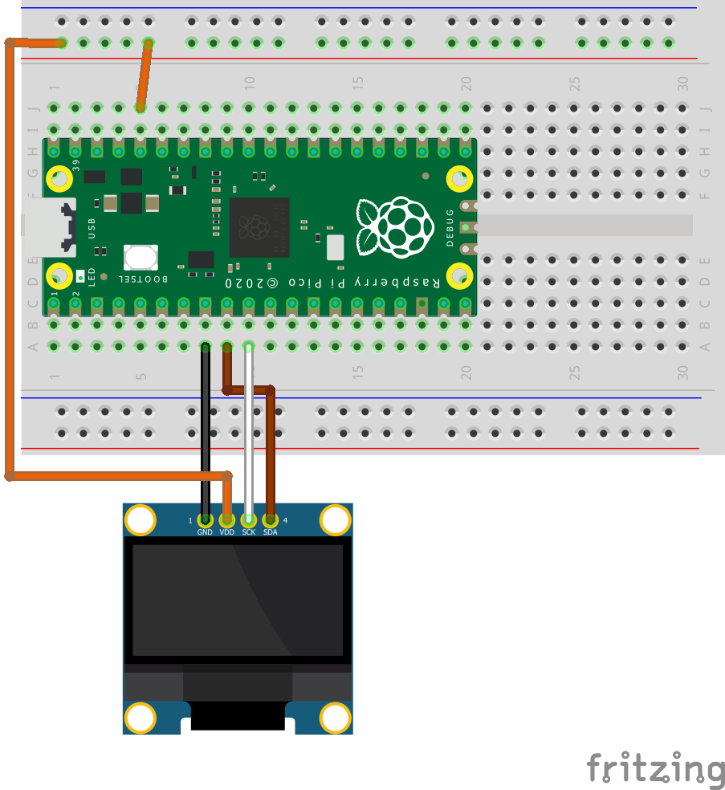

# DISPLAYS BASIC HW TEST (Spanish)- wip

## Objetivo

Se trata de compilar en este tutorial, todos los test hw básicos de los displays más habituales:

- LCD 16x2 y 20x4 - I2C: solo texto

- SSD1306 128 x 64- I2C : Grafico , monocromo

- ST7789 240 x 320 - SPI : Grafico 64k colores

- ILI9341 240 x 320 - SPI: Grafico 2.8”/3.2· 320 x 240, RGB 64K + touch screen XPT2046 + SD card 

## <u>LCD 16x2 y 20x4 - I2C: solo texto(fin)</u>

## Tabla resumen de programas

| Programa              | HW                        | Funcionalidad                                                                                   |
| --------------------- | ------------------------- | ----------------------------------------------------------------------------------------------- |
| bhwt_LCDi2c20x4_v3.py | LCD i2c 20x4 - i2c dir 3E | Test básico de prueba de juego de caracteres + crear un carácter en char0, de los 8 disponibles |
| bhwt_LCDi2c16x2_v2.py | LCD i2c 20x4 - i2c dir 3F | Test básico de escritura + crear un caracter en char0, de los 8 disponibles                     |

### Alimentación y Consumo

Estos dos displays se deben alimentar a 5volt, por lo que :

1. la tarjeta pico esta conectada al ordenador por USB, 

2. o se alimenta por un powerbank o 

3. Se alimenta la PICO por VSYS a 5volt

Consumo medido por mi 

16 x 2 -> 25 mA a 5 volt

20 x 4 -> 43 mA a 5 volt

### Libreria/s

No hay una librería standard en micropython, por lo que se investigaron 3 opciones 

1. T622 -> Test ok tiene 3 años ==> OK con Pico 

2. Brainelectronics : 3 meses muchas funciones y custom char —> MAL algunas funnciones

3. Sunfounder : pocas funciones

Selecciono la librería del **usuario T62** : [GitHub - T-622/RPI-PICO-I2C-LCD: ](https://github.com/T-622/RPI-PICO-I2C-LCD)

Va Ok a 400.000Hz, tiene función de crear emojis x8. **Se usan dos librerías combinadas en jerarquía**, re-definiendo la capa superior algunas funciones como ***hal_write_command***

### Conexionado usado en los Test

| pin # PICO | Pin Logico en PICO              | Display |
|:----------:|:-------------------------------:|:-------:|
| 40         | VSYS o **+5volt** con GND común | VCC     |
| 8          | GND                             | GND     |
| 6          | I2C0 SDA                        | SDA     |
| 7          | I2C0 SCL                        | SCL     |

Importante: **comprobar que el puente de la iluminación esta conectado**

### Dirección I2C y scan previo

Los displays LCD suelen tener una de dos direcciones 3E o 3F. El programa de test incluye un *scan* del bus I2C que muestra las direcciones I2C encontradas, por si la dirección fuera distinta

### Coordenadas de la pantalla

Los displays LCD son solo de texto, por lo que el posicionado es (línea, columna)

- En los LCD 20x4 línea va de **0 a 3** , columna va de **0 a 19**

- En los LCD 16x2 línea va de **0 a 1** , columna va de **0 a 15**

- En ambos (0,0) corresponde a esquena superior derecha

### Test1 - LCD 20x4 - I2C

0- Crea los objetos I2C y luego el display lcd +  crear un carácter en char0, de los 8 disponibles

1- Llenar display con todo el juego de caracteres los caracteres

2- Llenar display con mensaje de prueba

- Incluye un carácter creado por bit

- Muestra el día y la hora ( no sincroniza, pero si esta conectado a Thonny este si ajusta el RTC de la PICO)

### Test2 - LCD 16x2 - I2C

0- Crea los objetos I2C y luego el display lcd +  crear un carácter en char0, de los 8 disponibles

1- Llenar display con mensaje de prueba

---

## <u> SSD1306 128 x 64- I2C (fin)</u>

### Tabla resumen de programas

| Programa                             | HW                           | Funcionalidad                                                                              |
| ------------------------------------ | ---------------------------- | ------------------------------------------------------------------------------------------ |
| bhwt_SSD1306_128x64_cmd_graph_3_0.py | OLED i2c 128x64 - i2c dir 3C | Test básico de prueba de comandos gráficos de la libreria SSD1306 que hereda a framebuffer |

### Alimentación y Consumo

Estos displays SSD1306 se pueden alimentar a 3.3volt, y consumen ( medido por mi) entre 3 - 6 mA **por lo que pueden alimentarse directamente del pin 36 de la PICO** , que según datasheet puede entregar hasta 300 mA

### Libreria para SSD1306

Es la libreria standard, creada originariamente por Adafruit, la versión que usamos es de **Stefan Lehmann**

[GitHub - stlehmann/micropython-ssd1306: A fork of the driver for SSD1306 displays to make it installable via upip](https://github.com/stlehmann/micropython-ssd1306)

### Conexionado para SSD1306 usado en los Test

| pin # PICO | Pin Lógico en PICO | Display |
| ---------- | ------------------ | ------- |
| 5          | 3.3volt out pico   | VCC     |
| 8          | GND                | GND     |
| 9          | I2C1 SDA           | SDA     |
| 10         | I2C1 SCL           | SCL     |

Algunos displays SSD1306 incluyen una línea de **RESET** que ha de estar primero a GND y luego a +5volt para que el display funcione, en cualquier caso ver documentación.

### Dirección I2C y scan previo

Los displays OLED suelen tener una direcciones i2c = 3C. El programa de test incluye un *scan* del bus I2C que muestra las direcciones I2C encontradas, por si la dirección fuera distinta

### Coordenadas de la pantalla

Los displays OLED son gráficos y el posicionado es (x, y), (0,0) corresponde a esquina superior derecha.

Los textos se posicionan con la primera letra en la esquina superior derecha

### Test1 - SSD1306 - Comandos Gráficos v3

F- Define varias funciones graficas

def show_rect():
    """Display in oled a rectangule 20 x 16"""
def show_Frect():
    """Display in oled a filled rectangule 20 x 16"""

def show_normal():
    """Display in normal mode (not inverted)"""

def show_circ():
    """Display in oled a circule r= 20"""

def show_ellipse():
    """Display in oled an ellipse rx= 40, ry=20"""

def show_QFellipse():
    """Display in oled a 1/4 ellipse rx= 40, ry=20"""

def show_triangle():
    """Display in oled a triangle """

def show_pentagono():
    """Display in oled a pentagono """

def show_options():
    """Display Options for drawing in display """

0- Crea Objeto I2C y LCD

1- Programa Principal - Presentación

2- try - except para salir con cntr+C

        3- Bucle principal ( infinito)

                # 3.1 - limpia pantalla -> Muestra menú + input opción menú

                # 3.2 Ejecuta la opción de menu, las funciones son objetos en Python

                3.3 Gestiona error de opción de menú

4- except : si CTRL+C se presiona - > limpiar display

---

## ST7789 240 x 320 - SPI : Grafico 64k colores

### Librería Russ Hughes en C ( y alternativas)

Elegimos esta libreria por potencia, documentación y porque vale para los display ST7735, ST7789 e ILI9341

Referencia :

Es un libreria compilada con la fuente de micropython

#### Librería Russ Hughes- tft_config

Guardaremos las configuraciones de conexión y otros parámetros en "tft_config.py", asi nos valdrán los mismos programas con cambios muy pequeños. 

#### 

#### Librería Russ Hughes- HW Test básicos

| Programa                                                                                                            | Funcionalidad                                                                         |
| ------------------------------------------------------------------------------------------------------------------- | ------------------------------------------------------------------------------------- |
| bhwt_ili9341FW_B_colorR1_1_0.py_1_0.py                                                                              | **Colores de letra y Fondo** Muestra combinaciones de color de letra y fondo de texto |
| Rotación 1 = apaisado – pines derecha                                                                               |                                                                                       |
| bhwt_ili9341FW_McenterR1_1_0.py                                                                                     | **Texto en centro Display & caracteres castellano**                                   |
| Muestra un texto centrado en el display + uso de caracteres con acento y “ñ” (no UTF-8)                             |                                                                                       |
| Rotación 1 = apaisado – pines derecha                                                                               |                                                                                       |
| bhwt_ili9341FW_fill_irisR1_1_0.py                                                                                   | **Color de Fondo Arcoiris**                                                           |
| El color de fondo del display cambia recorriendo el arco iris (255 pasos). Usa función de cambio de RGB888 a RGB565 |                                                                                       |
| Rotación 1 = apaisado – pines derecha                                                                               |                                                                                       |
| bhwt_ili9341FW_4fontsR2_1_0.py                                                                                      | **Todos char de 4 fuentes**                                                           |
| Muestra cada uno de los caracteres de 4 fuentes de 127 char (no char castellano)                                    |                                                                                       |
| Rotación 2 = Retrato – pines arriba                                                                                 |                                                                                       |
| bhwt_ili9341FW_lineasHyVR2_1_0.py                                                                                   | **Cuadricula de lineas**                                                              |
| Muestra líneas horizontales y luego verticales, con separación de 10 pixeles                                        |                                                                                       |
| Rotación 2 = Retrato – pines arriba                                                                                 |                                                                                       |
| bhwt_ili9341_pacmanR2_2_0.py                                                                                        | **(AVD) Demo de sprites**                                                             |
| Ejemplo de cómo manejar sprites, definiéndolos con bitarray - Avanzado                                              |                                                                                       |
| Rotación 2 = Retrato – pines arriba                                                                                 |                                                                                       |
